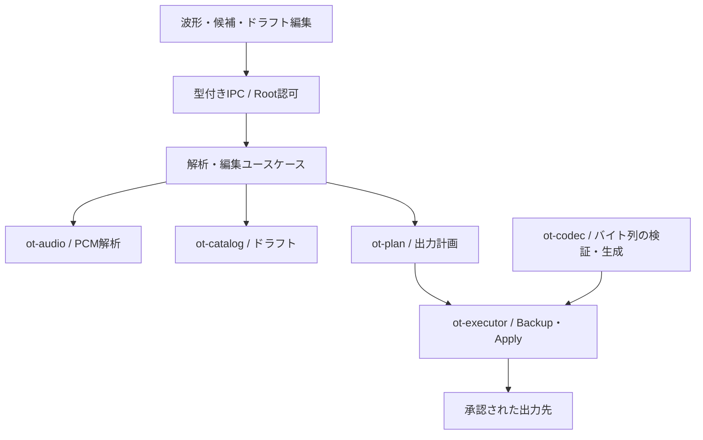
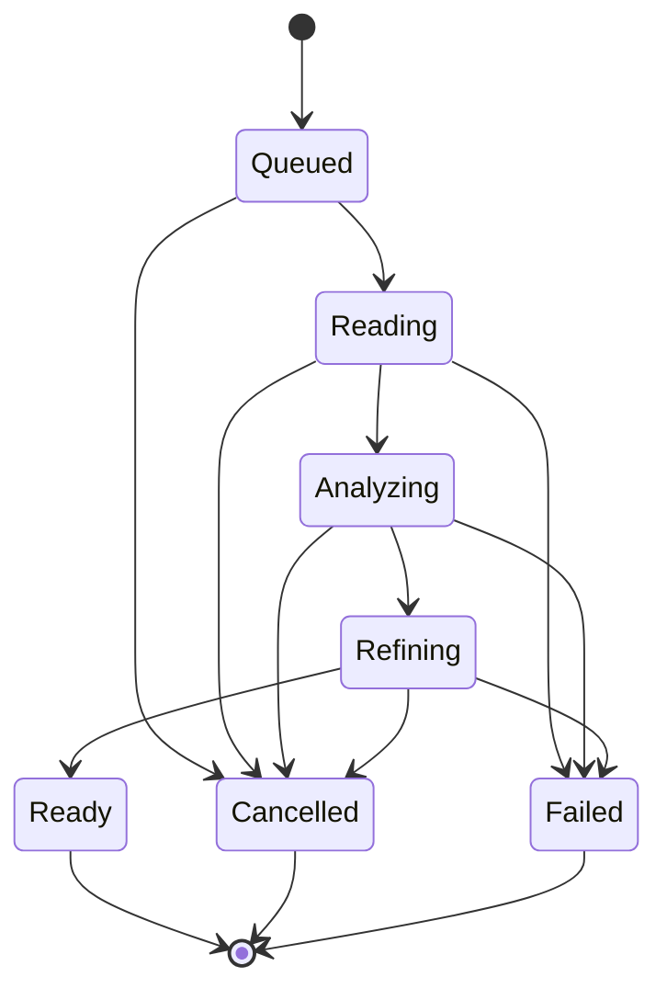

# Masta-Octa アタック検出・自動スライス 技術設計

設計ID: AUTO-SLICE-1 / revision 1.0 / 調査環境日付: 2026-09-07 UTC

状態: 実装提案。現行コード調査済み。DSPの実音源評価、実装、バイナリ形式の追加鑑定、実機受入は未実施。

調査基準: `kaz4g/masterocta` の `main`、commit `7b5b740d1db195f99d2bd78b46713531cfda41c5`。本書は設計提案であり、コード変更・媒体操作・Gate通過の承認を含まない。数値は「既存コードの事実」「外部仕様」「提案する初期値」「未確定」を区別する。

## 1. 採用する構成と完成範囲

Rustの既存 `ot-audio` を拡張し、元音声のPCMから複数帯域のspectral fluxを計算する。候補位置をPCMで再検査し、アタックの直前へ境界を置く。Reactは波形、候補、手修正、試聴を担当する。編集結果はMac側SQLiteへ保存する。Octatrack用ファイルへの反映だけを `Intent → Plan → Apply` に通す。

最初の完成単位は「ドラムブレイクを解析し、編集・試聴でき、再起動後もドラフトを復元できること」。その後、複製した音声と `.ot` を新しい名前で出力する。既存Projectのスロット編集は別段階。

対象には単独キック、スネア、ハット、パーカッション、ドラムブレイクを含む。音楽全体、残響の多い音、長いベースの上の弱い打音は扱える範囲を評価するが、完全自動を保証しない。パッド・管楽器の緩やかな立ち上がりは初版の精度保証対象外。

アタック検出は時間位置を求める。キック／スネア分類、ステム分離、テンポ推定、拍への自動整列は別機能。開始位置が正確なことと、演奏として良い切り方であることも別に評価する。

## 2. 現行コードから確定した接続条件

| 項目 | 確認した現状 | 設計への反映 |
|---|---|---|
| アプリ | React 19、TypeScript、Tauri 2、Rust workspace | 新しいPython常駐サービスを追加しない |
| 音声 | `ot-audio` はSymphoniaのWAV/AIFF/PCMを使用 | decoderを共通化し、既存preview用16bit音声を解析入力に使わない |
| 波形 | `waveform:v1`、最細粒度256 PCM frames/peak、4倍ごとの階層 | 検出には流用せず、拡大表示にrange APIを追加 |
| 波形UI | `WaveformPreview.tsx` は640点の全体SVG | フル表示用previewを残し、編集用viewportを別componentにする |
| 試聴 | 先頭60秒、最大32MiB、16bit WAV、one-shot token | 任意区間を返す新APIが必要。現行機能の単なるseekでは足りない |
| 実行 | `v2_api.rs` の音声APIは既に `spawn_blocking` を利用 | job管理・取消・世代管理を追加。FFTをReactやasync executor上で直に回さない |
| 設定所有者 | `SlotAssignment` と `FileInstanceSidecar` を区別 | 同じAudioAssetに対する設定でも自動共有しない |
| 読取モデル | `SampleSlice { index, trim_start, trim_end, loop_start }` はraw `u32` | 編集用の意味付き座標モデルを新設。raw値を直接UIの座標にしない |
| カタログ | `sample_settings` と `sample_slices` はスキャン結果 | ユーザードラフトを別テーブルに保持。rescanで消さない |
| codec | 新 `ot-codec` はProject参照PATHの部分書換え等が中心 | `.ot` lossless writerは追加設計・fixture検証が必要 |
| 読取adapter | `.ot` は `SampleSettingsFile`、slot markersは `MarkersFile` から読む | 読めることを安全に再保存できる証明にしない |
| ロードマップ | `NEXT_GENERATION_ARCHITECTURE.md` ではM6=Portable Project、M7=Slice/Chain | 自動スライスはM7の独立作業線として設計。M6へ無断で取り込まない |

`CODEX_HANDOFF.md` 内の現状SHA表記は調査時mainより古い。マイルストーンの意味・境界として参照し、最新mainの証拠と混同しない。Gate Cの現時点PASS/FAILは今回の調査対象にしていない。

根拠: [音声実装](https://github.com/kaz4g/masterocta/blob/7b5b740d1db195f99d2bd78b46713531cfda41c5/src-tauri/crates/ot-audio/src/lib.rs)、[波形UI](https://github.com/kaz4g/masterocta/blob/7b5b740d1db195f99d2bd78b46713531cfda41c5/src/features/waveform/WaveformPreview.tsx)、[設定所有権](https://github.com/kaz4g/masterocta/blob/7b5b740d1db195f99d2bd78b46713531cfda41c5/docs/domain/OCTATRACK_STATE_AND_SAMPLE_SEMANTICS.md)、[アーキテクチャ正本](https://github.com/kaz4g/masterocta/blob/7b5b740d1db195f99d2bd78b46713531cfda41c5/docs/NEXT_GENERATION_ARCHITECTURE.md)。

## 3. 責務と依存方向



矢印は処理・データの流れ。crate依存は下記を正とする。

| 層 | 新規・変更するもの | 禁止する責務 |
|---|---|---|
| `ot-domain` | `PcmFrame`、`SliceDraft`、`SliceBoundary`、範囲検証 | FFT、Tauri、SQLite、filesystem依存 |
| `ot-audio` | decoder共通化、STFT、特徴量、候補検出、境界補正、range preview | `.ot`やProjectへの書き込み |
| `ot-storage-ports` | draft repository、解析artifactへのport | 具体的なSQLite実装 |
| `ot-application` | `AnalyzeOnsets`、`GenerateSliceProposal`、`SaveSliceDraft` | `ot-audio`やlegacy実装への直接依存。必要なtraitをport化 |
| `ot-catalog` | ドラフトと編集revisionの永続化 | 媒体ファイルを正本として上書き |
| `ot-codec` | `OtSampleSettingsDocument`、検証済み部分patch | ファイルopen/write、Root権限判断 |
| `ot-plan` | 出力対象・設定diff・precondition・postcondition | ディスクの直接変更 |
| `ot-executor` | staging、backup、journal、適用・復旧 | DSPの閾値や音楽的判断 |
| Tauri composition | backend-only snapshot管理、job管理、port実装の接続 | 検出式や編集ルールの埋込み |
| `src/api` | `slices.ts`、音声range DTO、job event | UIからのraw path read |
| `src/features/slices` | toolbar、markers、slice list、preview操作 | 直接 `invoke()`、SQL、ファイル書き込み |

最初から `ot-dsp` 等のcrateを大量追加しない。`ot-audio` 内のpure moduleとして始め、codec/storage境界は既存の規則に合わせる。解析portの配置は `ot-storage-ports` のread service traitか、必要最小の新port crateをADRで決定し、applicationから具体実装への依存を作らない。

### 3.1 技術選定

| 技術 | 判断 | 理由 |
|---|---|---|
| Symphonia | 既存のlocked versionを再利用 | WAV/AIFF decoderの二重化を避ける |
| RustFFT | 新規直接依存として採用提案 | RustでFFTを完結。planとscratch bufferを再利用できる |
| SQLite / rusqlite | 既存基盤を利用 | ドラフト更新のtransactionとrevision競合を扱える |
| Canvas 2D＋DOM/SVG overlay | 波形編集に採用 | PCM/peak描画と、選択・キーボード操作を分ける |
| Web Audio | 区間試聴に採用 | audio clockで開始・終了を指定する |
| librosa | 開発時の比較基準に限定 | 同梱Python・環境差・起動コストを増やさない |
| aubio / Essentia / ONNX | 初版には追加しない | まず小さなDSPで実音源評価し、必要性を確認する |
| Web Worker / WASM | 初版の検出処理には不要 | Rust側が既にある。PCMをfrontendへ大量転送しない |

RustFFT 6.4.1の公式APIを調査したが、採用時はMSRV・lockfile・ライセンス・依存監査を確認して版を固定する。`scripts/check-architecture.mjs` の `ot-audio` 許可依存へ `rustfft` だけを根拠付きで追加し、guard全体を弱めない。[RustFFT](https://docs.rs/rustfft/6.4.1/rustfft/)、[scratch API](https://docs.rs/rustfft/latest/rustfft/trait.Fft.html)、[Symphonia](https://docs.rs/symphonia/0.5.5/symphonia/)。

## 4. 座標・音声同一性の契約

### 4.1 唯一の編集座標

編集位置は元音声のPCM frameを使う。1 frameは同じ時刻の全channel分で、stereoのL/Rを2 framesとして数えない。

- Rust: `PcmFrame(u64)`、範囲は `FrameRange { start, end_exclusive }`。
- 全範囲: `[0, decoded_frame_count)`。境界は `0..=decoded_frame_count`。
- スライス: `0 <= start < end_exclusive <= decoded_frame_count`。
- 検出用STFT frameは `AnalysisFrameIndex` と命名し、PCM frameと型を分離。
- 新IPCのframe値は10進整数文字列。JS内部はBigIntで保持し、viewport内の差だけNumber化。
- 許可する文字列表現は `0` または先頭ゼロなしの数字列。負数、指数、NaN、桁上限超過を拒否。
- 秒は表示・再生APIへ渡す際だけ `pcmFrame / sourceSampleRate` で算出。
- `.ot` の整数単位・endの包含関係は別のcodec profileで変換。raw `u32`の名前から推定しない。

非負の時間設定をframeへ変換する場合は `floor(milliseconds * Fs / 1000 + 0.5)` に統一する。feature統計窓の包含判定は整数frame差で行い、同じms値に異なる丸め規則を使わない。音声sourceのframeは測定の整数正本であり、秒から再生成して保存し直さない。

例: 44,100 Hz stereoの1秒地点は44,100 frame。88,200ではない。48,000 Hz音源の48,000 frameを44,100 Hzとして解釈すると時刻がずれる。

### 4.2 検出位置と境界を分ける

各候補に、少なくとも次の値を残す。

| 値 | 意味 |
|---|---|
| `noveltyPeakFrame` | STFT特徴量上の山を元PCM座標へ写した位置 |
| `estimatedAttackFrame` | 原PCMで再検査した立ち上がり推定位置 |
| `suggestedStartFrame` | 前倒し・任意補正後の推奨境界 |
| `committedStartFrame` | ユーザーの編集結果。候補とは別データ |

補正を累積適用しない。前倒し設定を変更するたびに `estimatedAttackFrame` を基準に再計算する。

### 4.3 読んだ音声を固定する

解析中の媒体変更を避けるため、backendの登録済みrootからdescriptor-basedで読み、Mac側のprivate一時領域へsource snapshotを作る。streaming copyと同時にSHA-256を計算し、catalogで選択したrevisionのhashと一致したsnapshotだけ解析対象に昇格する。

- path登録以外はopaque `RootId` とfile instance IDを使う。絶対pathはfrontendへ返さない。
- コピー元のdevice・file identity・長さを開始と終了で確認する。rootを再検証する。
- snapshotを途中公開しない。完成hashが一致しない場合は `SOURCE_CHANGED`。
- decoder、精密波形、解析、区間試聴は同じsnapshot revisionを参照する。
- snapshot利用中に元fileが変わったら、ドラフトをstale表示にし、書き出しを拒否する。古いsnapshotの試聴を提供する場合は旧revisionであることを表示する。
- 書き出し前はsnapshotだけでなく対象媒体をfresh hashで再検証する。
- 終了・取消後に不要なsnapshotを削除。クラッシュ残骸は所有権を検証できるApp Support内のjob artifactだけ清掃。

初回にはhash/copyのI/Oコストが発生する。CFカードの速度をFFT速度に混ぜず、画面に「読み込み」と「解析」を別々に示す。将来、同一ハンドルの安全な読み出しへ最適化しても、どの音声bytesを解析したかの証明は維持する。

## 5. 入力と資源上限

初版の解析対応: WAV / AIFF、PCM 16/24bit、mono/stereo、44.1/48kHz。その他の形式を既存browserが表示できても、解析対応済みと見なさない。MP3等は明示的な変換後の新Assetを対象にする。

| 制限 | 初期提案 | 超えた場合 |
|---|---|---|
| 選択した解析区間 | 最大10分 | 範囲を狭める。途中までを成功として返さない |
| source snapshot | 最大2GiB | 別途音声を切り出した新Assetが必要 |
| 生候補 | 最大32,768件 | `ANALYSIS_COMPLEXITY_LIMIT`。感度・範囲を調整 |
| 編集ドラフト | 最大4,096 slices | proposalのまま保持し、範囲変更・選別を求める |
| Octatrack出力 | 最大64 slices | `SLICE_COUNT_EXCEEDED`。暗黙削除なし |
| 1回の波形応答 | 最大4,096 buckets/ch | viewport分割 |
| 1回のraw PCM波形応答 | 最大16,384 frames、2ch | 適切なLODへ戻す |
| 1回の試聴区間 | 最大30秒、float32 PCM 16MiB以下 | 切詰めず、区間を再指定 |
| decoded試聴LRU | 合計32MiB | 使用中でないbufferから破棄 |

予算目標: 解析workerの追加RSS 128MiB以内。予約・buffer長のchecked arithmeticで上限を設け、256MiBを超えるallocation要求を拒否する。OSやdecoderまで含めたRSSを厳密に256MiBへ封じる保証ではない。

source snapshot・特徴量cacheはApp Support内に置き、初期総予算4GiB、active artifactはevictしない。全active分が予算を超える場合はジョブ開始を拒否する。空き容量不足も事前判定するが、実書き込み時の失敗も処理する。ユーザーの音声を外部送信しない。

## 6. DSPパイプライン

以下の数式・定数はAUTO-SLICE-1の評価用baseline。アルゴリズムの骨格は固定し、係数は実音源評価後にversion付きpresetとして凍結する。現時点の精度実績ではない。

### 6.1 PCM decodeと検査

Symphoniaでstream decodeし、各channelをfloat32へ変換する。元音声のsample rateを維持し、解析目的のresample・normalize・stereo mixdownは行わない。

- headerが宣言したPCM長と実際のframe数を照合する。
- packet境界の不整合、channel/rateの途中変更、非有限値、不完全な最終frameはエラー。
- 予期しないEOFを正常EOFとして扱わない。既存 `DecoderState::next_packet` の `UnexpectedEof → None` だけでは、新しい解析の完全性検証にならない。
- NaN/Infを0へ置換しない。静かに欠損を補わない。
- 選択範囲を超えるデコードも実計数で上限を適用。壊れたheaderのdurationを信用しない。

### 6.2 解析窓と時間対応

| 項目 | 初期値 |
|---|---|
| 低域用FFT | 2,048 samples |
| 中高域用FFT | 1,024 samples |
| hop | 128 PCM frames |
| 窓 | periodic Hann: `w[n] = 0.5 - 0.5*cos(2*pi*n/N)` |
| 時間原点 | 音声全体のframe 0 |
| frame中心 | `t_m = m * hop` |
| 窓範囲 | `[t_m-N/2, t_m+N/2)` |
| 音声の外側 | 0 padding。実音声としてframe数へ加算しない |

44.1kHzではhop約2.90ms、短窓約23.22ms、長窓約46.44ms。hopは候補の探索刻みで、切り口の最終精度ではない。

区間解析でもSTFT gridを選択範囲先頭から再開始しない。必要区間の前後に少なくとも500msのcontextを読み、音声全体の原点で計算する。FFT中心・local statistics・境界探索用contextが足りなければ範囲を拡張する。真のファイル端だけpaddingを許す。

FFT planとscratchをjob内で再利用する。frameごとのheap allocationを避ける。windowは固定順序で計算し、band境界は `k*Fs/N` によって決める。

### 6.3 周波数変化を左右別に測る

左右を加算すると逆相音源を見落とすため、channelごとに特徴量を計算してから統合する。

窓の利得を正規化した振幅スペクトルを `A_c[m,k] = abs(FFT(x_c*w))[k] / sum(w)` とする。DC/Nyquistの片側補正に依存しないよう、ここでは片側振幅の2倍補正はしない。全ての窓で同一規則を使用する。

```text
L_c[m,k] = log(1 + 1000 * A_c[m,k])
R_c[m-1,k] = max(L_c[m-1,k-1], L_c[m-1,k], L_c[m-1,k+1])
D_c[m,k] = max(0, L_c[m,k] - R_c[m-1,k])
F_c,b[m] = mean(D_c[m,k] for k in band b)
F_b[m] = max_c(F_c,b[m])
```

周波数端のmax filterは有効binだけを使う。存在しない前frameは0とする。音量の絶対値ではなく成分の増加を使う。隣接binのmax filterはピッチ揺れによる過剰候補を抑える補助。

| 帯域 | FFT | 対象となりやすい変化 | 重み初期値 |
|---|---:|---|---:|
| 30–180Hz | 2,048 | キック・低音打撃 | 0.35 |
| 180–2,500Hz | 1,024 | スネア・打楽器の胴 | 0.40 |
| 2,500–min(18,000Hz, 0.45Fs) | 1,024 | ハット・打音の高域 | 0.25 |

帯域名は楽器分類結果ではない。低音シンセも低域候補になり得る。周波数差分方式の参考: [librosa onset strength](https://librosa.org/doc/0.11.0/generated/librosa.onset.onset_strength.html)。上記のchannel統合・窓・係数は本設計独自の提案で、librosaと同一出力を約束しない。

### 6.4 局所正規化とピーク選択

音量差に追従するため、各bandの前後200msを対象にmedianとMADを計算する。偶数長集合のmedianは中央2値の平均。統計窓には現在frameを含め、ファイル端は実在する解析frameでclipする。

```text
median_b[m] = median(F_b in local window)
mad_b[m] = median(abs(F_b - median_b[m]) in local window)
Z_b[m] = clamp((F_b[m] - median_b[m]) / (1.4826*mad_b[m] + 0.0001), 0, 20)
S[m] = max(0.35*Z_low + 0.40*Z_mid + 0.25*Z_high,
           0.70*max(Z_low, Z_mid, Z_high))
threshold(sensitivity) = 5.0 - 0.035*sensitivity
```

感度は0–100、初期50。thresholdは感度0で5.0、100で1.5。独立した高域の変化が帯域平均に埋もれないようmax項を加える。MADがほぼ0の音源、圧縮の強い音、弱いゴーストノートについて、床値を含め評価する。

候補条件:

1. `S[m] >= threshold`。
2. 前後8ms内のlocal maximum。plateauは最も早いframeを採用。
3. PCM補正後の `estimatedAttackFrame` 周辺10msの最大channel RMSがsilence floor以上。FFT中心は立ち上がりより前に出るため、補正前の中心ではgateしない。初期floor=-72dBFS、詳細設定で-90〜-40dBFS。

RMS gateは帯域の意味を持たず、完全無音・量子化ノイズ排除の補助。背景が大きい素材の誤検出はこのgateだけで解決できない。

`strengthScore = S/(S+threshold)` とband別score・threshold marginを保持する。UI表記は「検出の強さ」。校正していない数値を「正解確率90%」と表示しない。

感度を変えたときは特徴量を再計算せず、threshold以降だけを再実行する。局所統計もversion付き特徴量artifactに保持できる。

### 6.5 PCM上での立ち上がり再検査

STFT中心は切り口ではない。窓の影響で特徴量の山が実アタックより前または後に来るため、一定の遅延を一律に引くだけにはしない。

1. 候補 `t_m` の前後からPCMを取得する。初期探索範囲は `t_m - N_long/2 - 20ms` 〜 `t_m + N_long/2 + 10ms`。音声全体の範囲でclipする。
2. channelごとに0.5ms長の移動RMS envelopeを求め、その最大値 `E[n]` を使う。RMS窓は `[n-W+1,n]` の因果窓、`W=max(1,round(Fs*0.0005))` と明記する。
3. `G[n]=max(0,E[n+W]-E[n-W])` の局所最大を立ち上がり候補とする。候補に対して `G[n]*exp(-0.5*((n-t_m)/(N_short/2))^2)` を評価する。
4. 最も高い評価のriseを選ぶ。同点は早い位置。複数のSTFT候補が同じriseに割り当たった場合は、score優先で1件にまとめ、消した候補IDを診断に残す。
5. riseの直前、最大20msまで戻る。局所minimumを基点に、そのminimumとrise後方の `E[rise+W]` の差の10%を初めて上回り、以後0.5ms以上上回る位置を `estimatedAttackFrame` とする。0.5ms RMSの平滑化誤差は評価対象に含める。
6. 有効なrise/minimumがない、最良と次点の評価比が1.25未満、近接打音の対応が曖昧な場合は `BOUNDARY_UNCERTAIN`。位置を捏造せず、暫定境界と推定範囲を表示する。

この局所RMS法は、低音の持続中にハットが乗る場合には弱い。該当subsetで失敗が多ければ、優勢bandのFIR envelopeを使うrefinerを追加評価する。FIRを入れる際は群遅延と端paddingを座標契約に追加する。初版から「band検出を入れたので境界精度も保証できる」とはしない。

音声先頭から既に鳴っている場合は「真のアタックがファイル外」の可能性がある。最初の活動領域に境界0を提案し、`LEFT_EDGE_TRUNCATED` を付ける。検出成功の正答件数へ無条件で含めない。

### 6.6 前倒しと短距離補正

`suggestedStart = estimatedAttack - preRollFrames`。pre-roll初期1ms、範囲0–10ms。選択範囲と隣接境界を越えないよう検証する。

ゼロクロス補正の初期状態はOFF。ON時も探索は初期±0.5ms、最大±2ms。アタックを欠かさないよう `estimatedAttack` より後へは移動しない。

stereoの両channelで同じゼロ位置が存在するとは限らない。候補nはどちらかのchannelの符号変化位置を列挙し、次の順で選ぶ。

1. `max_c(max(abs(x_c[n-1]),abs(x_c[n])))` が小さい位置。
2. 推奨境界からの距離が短い位置。
3. 同点は早い位置。

両channelの振幅が十分小さくならない場合は補正しない。低振幅判定は初期0.01 FS、要評価。monoの符号反転をstereo全体の無クリック保証にしない。内部名称は `lowAmplitudeSnap` とし、UI説明に「ゼロ付近へ補正」と表示する。

自動fadeは原音・`.ot`へ焼き込まない。試聴時のfadeは別スイッチとする。

### 6.7 最小間隔とスライス集合

境界を精密化した後で最小間隔を適用する。初期35ms、設定範囲10–250ms。これは自動提案の密度であり、手動マーカーの最小長制約ではない。

候補を `S降順 → 推定アタック位置昇順 → 安定候補ID` で並べ、既採用の推定アタックから指定間隔未満の候補を抑制する。手動固定境界に近い候補は自動追加しない。後で時間順へ並べ直す。

pre-roll/snapによりstartが重複・逆転した場合、auto同士は強い方を採用して警告する。手動固定との衝突は手動を保持し、自動候補だけを除外する。手動同士の不正な重複は保存時にエラーとし、位置を勝手に変更しない。

自動生成は連続区間方式:

```text
slice[i] = [start[i], start[i+1])
lastSlice = [lastStart, selectionEnd)
```

終端sentinelはスライス数に数えない。例えば64個の開始点＋終端1個で64スライス。

- 先頭無音: 初期は最初の検出位置から始め、無音区間を未割当として表示。「選択範囲の先頭を含める」で1スライス追加できる。
- 末尾: 最後のスライスは選択範囲末尾まで。残響・無音を自動切断しない。
- 検出ゼロ: 正常な `NO_ONSETS`。一律に1スライスを成功結果として作らない。手動の「全体を1スライス」は別操作。
- ROI途中から音が続く場合: 境界がアタックを切っている旨を表示し、ROI先頭を打音と誤表示しない。
- 既存 `.ot` の重複・gap・個別end・loopは表現上保持する。自動連続区間へ暗黙変換しない。

context内で検出したattackは精密化後にROI所属を判定し、`region.start <= estimatedAttack < region.end` の候補だけ採用する。ROI外のattackをclampして偽の先頭hitを作らない。ROI内attackのpre-rollが左端を越える場合だけstartを左端へ制限し、補正制限を表示する。新しく自動生成するsliceのloopはdomain上 `null`。既存loopの削除やraw sentinelへの変換は、別途検証済みのcodec契約に従う。

64超過は候補の一括切捨てをしない。範囲を狭める、最小間隔を広げる、感度を下げる、手動選別を提供する。「強い順に64」は将来の明示操作としてのみ追加可能で、元proposalを残す。

## 7. 特徴量cacheと再計算

cache keyの内部材料:

```text
source SHA-256
decoder build/version + PCM format contract
algorithm version (onset:drum:v1)
FFT/hop/window/band/log/normalization config digest
covered source frame range + analysis origin + context policy
numeric implementation / CPU profile when required
```

SHA-256やcache pathはbackendだけが扱い、frontendはopaque `AnalysisId` / `SourceRevisionId`を使う。特徴量cacheのcache hitは媒体の現在性を証明しない。

| 操作 | 再実行する処理 |
|---|---|
| 感度変更 | peak picking・refine対象差分・NMS・proposal |
| 最小間隔変更 | NMS・proposal |
| pre-roll変更 | 推定attackから境界を再計算・検証 |
| snap変更 | 近傍PCM検索・境界検証 |
| 手動移動 | 手動境界と隣接endの整合性検証 |
| 波形ズーム | peak/raw viewport取得のみ |
| FFT/band/version変更 | 特徴量から再解析 |
| 音声bytes変更 | 全て新revision。旧draftへ自動移植しない |

feature config digestにはFFT・band・窓・局所統計の規則を含める。感度、最小間隔、pre-roll、snapはproposal configとして別digestにし、感度変更でcandidate identityや高コストcacheを不必要に失効させない。

cacheは再生成可能な派生物。SQLiteのユーザードラフトは消してよいcacheではない。cache破損は破棄・再計算、source破損は停止、と分ける。

同じsnapshot・algorithm/config/build・数値profileでは同じ候補と順序を目標にする。ARM Neonとx86 SIMD間の浮動小数差まで無条件にbit一致とは言わない。cross-platform許容差を評価し、厳密なfixtureにはscalar referenceを用意する。承認後の境界値は整数で固定し、Apply時にDSPを再計算しない。

## 8. ドラフトの所有権・編集モデル

### 8.1 所有権

分析特徴量はAudioAssetで共有できる。編集ドラフトと保存設定は所有者を持つ。

```typescript
type Frame = string; // 検証済み10進u64。内部ではBigIntへ変換

type DraftOwner =
  | { kind: "fileSidecar"; fileInstanceId: string }
  | { kind: "slot"; projectId: string; stateRole: "working" | "saved";
      machine: "flex" | "static"; slotNumber: number }
  | { kind: "newVariant"; sourceFileInstanceId: string };

interface SliceBoundary {
  markerId: string;
  startFrame: Frame;
  end: { kind: "nextStart" } | { kind: "explicit"; endExclusive: Frame };
  loopStartFrame: Frame | null;
  provenance: "auto" | "manual" | "imported";
  locked: boolean;
  sourceCandidateId: string | null;
}

interface SliceDraft {
  schemaVersion: 1;
  draftId: string;
  revision: number;
  sourceRevisionId: string;
  owner: DraftOwner;
  sourceSampleRate: number;
  sourceFrameCount: Frame;
  region: { startFrame: Frame; endExclusive: Frame };
  algorithmVersion: string | null;
  settingsRevisionId: string | null;
  markers: SliceBoundary[];
  suppressedCandidateIds: string[];
  exclusions: Array<{ startFrame: Frame; endExclusive: Frame }>;
}
```

DTOは説明用契約。Rust domainはserdeやUI表現を知らない。DBにはsession `RootId`やraw absolute pathを保存しない。slot scopeは将来拡張用で、初版のwrite能力を意味しない。

### 8.2 再解析と手修正

- 解析結果は `SliceProposal`。解析完了イベントだけではdraftを書き換えない。
- 「候補を反映」でdraft revisionへ取り込み、1回のundo操作にする。
- 移動・追加・個別end変更した境界はmanual＋lockedへ昇格。
- 感度変更で置換するのはunlocked autoだけ。manual/importedは保持する。
- 削除したauto candidateはtombstoneに残す。近傍除外rangeも保持し、refinementによる数frame差で復活させない。
- 同じalgorithm/configではcandidate IDを元feature peak＋source revisionに紐付ける。algorithm変更でIDが変わっても除外rangeを保持する。
- 「固定解除」はその境界をauto再生成の対象へ戻す操作として説明する。
- 「全マーカーを置換」は別の明示操作。既存ループや個別endを削除するdiffを出す。
- undo/redoは手操作単位。ドラッグ中の各pixelを履歴1件にしない。
- 永続化はpointer-up、キーボード操作群の完了、候補反映時。debounceを補助にし、終了時には保存待ちを表示する。

### 8.3 永続化

新migrationは実装時の最新番号から採番する。既存 `sample_slices` をユーザードラフト保存先へ流用しない。

| table案 | 主な内容 |
|---|---|
| `slice_drafts` | draft ID、owner binding、source revision、sample rate、frame count、region、revision |
| `slice_draft_markers` | marker ID、順序、start、end mode、explicit end、loop、provenance、lock |
| `slice_draft_exclusions` | 削除候補IDと除外範囲 |
| `onset_analysis_artifacts` | source/config/version、coverage、artifact参照、完了状態、統計 |

draftがfile inventoryのrescan DELETE CASCADEで消えないよう、owner bindingはscan projectionから独立させる。backend内部のpersistent root fingerprint、validated relative locator、source hash、設定source hashを記録する。projectionのFKは補助としてnullableにし、削除時は未解決状態にする。再scan時に同じbytesでも所有者が違うsidecarへ勝手に再接続しない。

ドラフト更新は `expectedRevision` でcompare-and-swap。marker更新とdraft revision増分を1つのSQLite transactionで実施。0件更新なら `DRAFT_CONFLICT`。媒体が抜けても既存draftは残るが、対応rootが再検証されるまで新規解析・媒体への適用は不可。

編集コマンドは `AcceptProposal(proposalId)`、`MoveStart(markerId, frame)`、`InsertBoundary(frame)`、`DeleteBoundary(markerId)`、`SetExplicitEnd`、`SetLock`、`SetRegion` 等の判別共用体とし、任意JSON blobで内部状態を置換させない。`nextStart`方式の開始点移動は直前sliceのendにも影響するので、両方をdiff・undo単位に含める。`explicit`方式の合法なoverlapは保持し、連続方式専用validatorを既存sliceへ一律適用しない。

## 9. 非同期ジョブとIPC

### 9.1 公開API案

| API | 入力の中心 | 結果・役割 |
|---|---|---|
| `v2_audio_onsets_start` | rootId、fileInstanceId、sourceRevisionId、region、preset | jobIdを即返し、解析開始 |
| `v2_audio_onsets_status` | rootId、jobId | phase、処理量、error |
| `v2_audio_onsets_cancel` | rootId、jobId | cancel要求。協調取消 |
| `v2_audio_onsets_result` | rootId、jobId、cursor | analysisId、候補、source/config証拠、警告 |
| `v2_slice_proposal_create` | rootId、analysisId、draftId、expectedRevision、parameters | proposalId、変更diff、件数 |
| `v2_slice_draft_create` | rootId、owner、sourceRevisionId、初期設定 | draftId |
| `v2_slice_draft_get` | rootId、draftId | draft、stale状態 |
| `v2_slice_draft_update` | rootId、draftId、expectedRevision、typed edit commands | 新revision |
| `v2_audio_waveform_range_get` | rootId、sourceRevisionId、range、pixelBudget | channel別のpeakまたはraw PCM |
| `v2_audio_preview_region_create` | rootId、sourceRevisionId、range、preview mode | preview token＋音声区間情報 |
| `v2_slice_export_plan` | rootId、draftId、expectedRevision、destination | read-only plan |

媒体Applyは新しいslice operation種別を既存の承認・backup・prepare・継続・apply・verify・recoveryの共通契約へ接続する。rename専用のopaque authorityやAPI名をslice操作へ流用しない。初版analysis PRでmedia write commandを登録しない。

全APIでRootRegistry、IDとrootの対応、source revisionをbackendが検証する。frontendから来たmarker座標や件数を信用しない。eventは同じwindow/root/sessionだけへ配信する。

### 9.2 job状態



`Ready`にする直前にもcancel flag・source revision・request generationを確認する。job終了と取消の競合はbackend lock/CASで終端状態を一度だけ確定する。

- DSP同時実行は初期1 job。待ち行列上限4。大量開始は `BUSY`。
- `spawn_blocking` のhandleをdrop/abortしただけでは計算停止を保証できない。共有cancel flagをchunk・FFT batch・refine loopで確認する。
- CPU処理はおおむね10–25msのbatch単位で取消確認。I/OがOS内で止まった場合の応答時間は別に扱う。
- 実行中にwaveform cacheの全体mutexやSQLite transactionを保持しない。短いmetadata commitだけlockする。
- 進捗イベントは最大10Hz、phase・done/total・generation・sequenceを含む。大量PCMをeventに載せない。
- クライアントは `requestGeneration` とdraft revisionを照合し、遅れて届いた旧結果を表示へ適用しない。
- チャンネル切断時もstatus APIから終端状態を取得できる。eventだけを正本にしない。
- 取消時はpartial cacheをready扱いにしない。元音声・既存draftは変更しない。

Tauriのchannelはprogress配送に利用可能。既存typed IPC clientに隠蔽してcomponentからの直接呼出を避ける。[Tauri commands](https://v2.tauri.app/develop/calling-rust/)、[blocking executor](https://docs.rs/tauri/latest/tauri/async_runtime/index.html)。

## 10. Waveform 2.0への組み込み

### 10.1 表示契約

Libraryの選択ファイルから、中央の大きな波形editorを開く。データソース選択は上部、左または下にslice list、書き出しは必要時のChange Drawerで扱う。

- 上段: 全体overview、選択範囲、現在viewport。
- 中央: monoまたはL/R別波形、開始marker、必要時の個別end/loop。
- 下段または横: slice番号、開始時刻、長さ、固定状態、試聴。
- toolbar: 自動スライス、感度、最小間隔、undo/redo。
- 詳細設定: pre-roll、ゼロ付近補正、silence floor。
- 時刻の拍グリッドはユーザーがBPMを指定した場合の補助表示。自動量子化はOFF。

自動候補は破線、取り込んだautoは実線、manual/lockedは鍵アイコンで区別する。色だけに依存しない。波形の巨大なDOM更新は避け、Canvasと独立overlayを使う。listにはキーボードfocusと数値入力を提供する。

### 10.2 LODと座標

既存waveform:v1の256frame bucketは最拡大時に不足する。新range APIではcoarse levelを既存cacheから供給し、近接ズームはsnapshot PCMから小さな範囲だけ生成する。stereo左右を分離した新cacheはversionを変え、旧cacheを誤読しない。

```text
x = (frame - viewportStart) / (viewportEnd - viewportStart) * width
frame = viewportStart + round(pointerX / width * (viewportEnd - viewportStart))
```

先にBigIntで原点を引く。各bucketは実際のstart/endとchannelを持ち、最終の短いbucketを全幅へ均等に引き伸ばさない。波形requestはviewport generationを持ち、古いzoom結果を破棄する。

ドラッグはrequestAnimationFrame単位でlocal表示、pointer-up時にbackend検証・保存。snap検索を毎pointermoveで媒体へ問い合わせない。近傍PCMは表示範囲の限定cacheから使うか、backendのdebounced候補照会へまとめる。

zoomから検出を再実行しない。marker座標は画面pixelではなくPCM frameから再描画する。

## 11. 区間試聴

現行の先頭60秒previewを拡張するだけでは、長いサンプルの途中に置いたsliceを正しく確認できない。任意の `[start,end)` を同じsnapshotから取り出す新APIにする。

1. backendがrangeとrevisionを検証。
2. decoderが必要区間へseek。seek結果の実位置を確認し、必要なら手前からdecode/discardして正確な開始frameへ合わせる。
3. tokenはroot/session/source revision/rangeに束縛し、既存同様の短寿命・one-shotを維持。
4. 正確に切り出したchannel別float32 PCMをbinary responseで返す。前後contextを付ける場合は実範囲と `playStartOffsetFrames` / `playEndOffsetFrames` を返す。
5. frontendは元sample rateを指定して `AudioBuffer` を作り、 `AudioBufferSourceNode.start()` で再生する。

`HTMLAudioElement.currentTime`＋`setTimeout`で終端を制御しない。AudioBufferは使い回せるがSourceNodeは再生ごとに作り直す。クリック連打で前の音を止めるmono auditionを初期挙動にする。

音声出力時にWeb Audioがデバイスsample rateへ変換することと、編集のsource frame座標は別。再生側のframe数を `.ot` の位置へ逆流させない。[Web Audio仕様](https://www.w3.org/TR/webaudio-1.1/)。

切り口確認の「原音」ではfadeなし。任意の「クリック軽減試聴」は初期0.5ms程度のattack/release gainを適用するが、聴感が変わることを表示し、marker・保存音声へ反映しない。特に短いキックでfadeを標準ONにしてアタック欠けを隠さない。

30秒を超えるsliceの初版試聴は、任意の30秒以内の窓を選ばせる。先頭30秒だけを全slice試聴として表示しない。連続全長再生が必要になった時点でbounded streaming/AudioWorkletを追加する。

## 12. Octatrack用の出力

### 12.1 公式に確認した仕様と未確認事項

公式マニュアルでは、mono/stereoの16/24bit・44.1kHz WAV/AIFF、最大64 slices、個別長や重複slice、サンプル設定を保存して次の読込時に利用する操作が説明されている。一方、`.ot` のバイナリoffset、endの包含関係、無効loop sentinel、checksum式、設定の優先関係の全条件はこの資料だけでは確定できない。[Elektron OS 1.40A manual](https://www.elektron.se/wp-content/uploads/2024/09/Octatrack-User-Manual_ENG-OS1.40A_220204.pdf)。

48kHz入力は解析・ドラフトまで対応できるが、初版ではそのままOctatrack出力しない。先に明示的な44.1kHz変換で新Assetを作り、その音声を再解析する。単純に `oldFrame*44100/48000` でmarkerを移すだけの変換は、resampler遅延・trim・丸めを検証するまで導入しない。

### 12.2 初版出力方式: 新しいvariant

新しいstem名を選び、例として `break_sliced_01.wav` と `break_sliced_01.ot` を新規作成する。音声は全fileをbyte-for-byte copyする。選択範囲のcropや音量変更は行わない。AIFFなら拡張子とcontainerを維持する。

このvariantはAudioAssetとして同一contentでもFileInstanceが新しくなる。元fileや元sidecarは変更せず、既存slot assignmentも変更しない。書き出し後に実機の空きslotへ読み込んで確認する。

既存 `.ot` だけの上書き更新は次段階。既存slotは独自設定を保持している場合があるため、`.ot`を作っただけで既存Projectが即座に同じsliceへ変わるとは表示しない。既存slotへの適用には別のslot-targeted Planと `markers.work` / `markers.strd` 等の形式検証が必要。

### 12.3 codecを開く条件

`OtFormatProfile` はfixtureで確定した組だけを扱う。

| 検証項目 | 必要な証拠 |
|---|---|
| file構造 | header、size/version、endian、slice table範囲 |
| 座標 | mono/stereo両方でPCM frameか別単位かを再現 |
| start/end | 先頭、末尾、1frame長、隣接sliceで包含関係を識別 |
| loop | 無効値、開始位置、全体loopとslice loopの関係 |
| count | 0/1/63/64、65拒否、indexと表示SL1の対応 |
| integrity | checksum有無・対象範囲・更新方法。既存validateの実際の検査内容 |
| global設定 | trim、gain、tempo、stretch、quantization等の扱い |
| unknown | 未知bytesと未使用slice slotの保持／変更規則 |
| 実機 | 対象OS/versionでload・save・reload・再生した証拠 |

全体trimは出力計画に明示する。選択範囲をglobal trimへ反映するならそのfieldをdiffへ含め、既存値と同じなら変更しない。tempoやstretchを推定値で上書きしない。新規 `.ot` のdefaultは検証済みtemplate/profileに由来させる。

既存sidecarがある場合は元bytesを保持するdocumentを読み、検証済みfieldだけpatchする。既存sliceを同一値のまま保存するno-opは完全byte一致。未使用slotの清掃、unknown fieldの0埋め、全面再serializeは行わない。

未対応version、破損、同stemにWAVとAIFFが共存してsidecar所有者が曖昧、意味未確定のloopを持つ場合は、該当出力をread-onlyへ退避する。解析・draft作業まで止める理由にはしない。

形式鑑定はリポジトリの `masterocta-format-evidence` とsource policyに従う。現行adapterの動作は実装証拠であり、メーカーによる形式保証ではない。

### 12.4 Planと適用

媒体の出力計画に以下を固定する。

- draft ID/revision、source revision/hash/size、source format、frame count。
- destination root fingerprint、検証済み相対path、新規2fileの不存在条件。
- 同stem・case-insensitive・Unicode正規化衝突の検査。
- serialized `.ot` bytes hash、音声copy hash、採用したprofileとcodec version。
- global設定とsliceのbefore/after、slice count、ownership scope。
- 空き容量、Mac側backup/staging、operation ID、postcondition。

解析結果は書き出し時に再計算しない。ユーザーが確認したdraftをimmutable Planへ固定する。

順序:

1. read-onlyでPlanを作り、対象fileとslice一覧を表示。
2. ユーザーが出力操作を承認。session限定の権限を確認。
3. sourceと必要な既存settingsをMacへverified backup。destination absentも固定。
4. Mac stagingに完成音声と`.ot`を作り、codec再読込とframe範囲を検証。
5. prepare journalをdurable化。
6. 同一rootのwriter lock、未完了operation、root identity、fresh hashを再確認。
7. operation固有partialからno-replaceで公開。2fileの公開完了まで成功表示しない。
8. 読み戻してhash、codec、slice、source不変を検証。
9. journalのdurable commitを先に確定し、catalog rescanを行う。catalog更新失敗は `committed / catalog-refresh-required` として分離し、成功した媒体変更を誤って再実行しない。

2fileは完全atomicではない。公開途中の電源断・媒体取り外しはjournalから復旧する。新規fileだけでもoperation ownershipと現在hashを確認せず削除しない。外部変更があれば `RECOVERY_REQUIRED` を維持し、ユーザーfileを推測削除しない。

既存renameのmutation gateと共通のroot gateへ参加する。rename prepared/applying/recovery中にslice出力が割り込まない。解析は許せるが、sourceが変わる場合は結果をstaleにする。

## 13. エラーと継続範囲

| code | 意味 | UIの次の操作 |
|---|---|---|
| `NO_ONSETS` | 有効候補なし。正常結果 | 感度調整、範囲変更、手動追加 |
| `BOUNDARY_UNCERTAIN` | 検出はあるが切り口が曖昧 | 拡大・原音試聴・手修正 |
| `SOURCE_CHANGED` | 元音声revision不一致 | 再scan、別draftとして再解析 |
| `ROOT_REMOVED` | 登録媒体が利用不可 | 保存済draftを保持、再接続 |
| `UNSUPPORTED_AUDIO_FORMAT` | decoder/初版対応外 | 対応形式の新Assetへ変換 |
| `CORRUPT_SOURCE` | 不完全PCM等 | 原音を確認。部分結果を適用しない |
| `ANALYSIS_COMPLEXITY_LIMIT` | 候補数・解析資源超過 | 範囲縮小。silent truncateなし |
| `SLICE_COUNT_EXCEEDED` | 出力64超過 | 候補整理。draftは保持 |
| `DRAFT_CONFLICT` | expectedRevision不一致 | 最新draft再取得、編集差分を保持 |
| `PLAN_STALE` | 計画後にdraft/source/target変更 | 再計画 |
| `OT_FORMAT_UNVERIFIED` | codecのwrite証拠不足 | 解析・draftは継続、出力は不可 |
| `AMBIGUOUS_SETTINGS_OWNER` | sidecar所有者不明 | 対象を整理。自動推定しない |
| `NO_SPACE` | snapshot/staging/target容量不足 | source不変で終了 |
| `RECOVERY_REQUIRED` | 未完了媒体操作 | 既存復旧画面へ。新しい媒体writeを禁止 |

全errorはsanitized code/message/recoverabilityを返し、absolute pathや生のOS errorをfrontendへ漏らさない。

## 14. 検証計画と合格目標

以下はこれから実施する受入条件。今回の設計作業でPASSしたという意味ではない。

### 14.1 DSP精度

最初に100 clipの評価セットを用意する提案。60を調整、40をholdoutへ分け、同じ原ループの加工variantを両側へ跨がせない。

| subset | clip数案 | 評価内容 |
|---|---:|---|
| 合成・isolated hits | 20 | 既知frame位置、bit depth、先頭末尾、低音phase |
| clean drum loops | 30 | kick/snare/hat、ghost note、flam、roll |
| 実録・残響・飽和 | 20 | 反射音・compressor pumpingの誤検出 |
| 音楽混合 | 15 | ベース上のハット、楽器同時発音 |
| 無音・noise・非打楽器 | 15 | false positive、曖昧結果の扱い |

人間annotationは「音響的立ち上がり」と「望ましいslice開始」を分け、曖昧な立ち上がりには区間を付ける。同時刻の複数楽器は時間onsetとして1件。NMSで省く短間隔hitも元annotationには残し、意図した最小間隔に応じた指標を別算出する。

| 指標 | 暫定合格目標 |
|---|---|
| clean drum onset F1 | 一対一matching、±10msで0.90以上 |
| 明瞭なアタックの境界 | `start - annotatedAttack` が-8〜+2msの範囲に95%以上 |
| clean loopの手直し率 | 全候補の15%以下を目安。追加・削除・移動を別集計 |
| clean digital silence | false positive 0 |
| 逆相stereo | 対応monoに対し検出消失なし |
| 拡大・再生 | 拡大でmarkerのsource frame値が変わらない |

F1はmaximum-cardinalityの一対一matchingを行い、複数予測を1正解に重複加点しない。precision、recall、早切り/遅切り、音源別の分布を出す。混合・残響素材は最初から同じ0.90を保証せず、実測値と手修正率を表示する。

librosaの結果は比較対象で、正解ラベルではない。両方が同じアタックを欠く可能性がある。[onset backtrack参考](https://librosa.org/doc/0.11.0/generated/librosa.onset.onset_backtrack.html)。

### 14.2 必須の回帰テスト

| 層 | 実際に防ぐ失敗 |
|---|---|
| 座標 | frameとsample/channelの混同、end off-by-one、44.1/48kHz混同 |
| DSP | 無音division、最初/最後のhit欠落、非常に短いclip、zero paddingで偽hit |
| stereo | L=-R、Lのみ、Rのみ、左右でずれたhit |
| PCM | 16/24bit、WAV/AIFF endian、partial frame、偽duration、NaN/Inf |
| region | 0原点固定、context不足、同じhitを違うROIで大きくずらさない |
| 再解析 | manual保持、deleted autoの復活防止、固定境界衝突 |
| job | cancel競合、root close、遅延応答、感度連打、source変更 |
| catalog | CAS競合、transaction rollback、再起動、rescan後draft保持 |
| preview | 60秒以降、seek補正、buffer上限、正しいend、expired/cross-root token拒否 |
| codec | no-op byte一致、unknown保持、checksum、count、loop、unsupported版 |
| executor | stale Plan、衝突、symlink/device差替え、容量不足、fault-point復旧 |

writerは合成fileと由来を記録したdisposable cloneだけで試験する。各mutation stepの直前直後に障害を注入し、原本不変かjournalによる復旧可能性を確認する。未知版を「読めたから書ける」とするfallbackをテストで拒否する。

### 14.3 性能

M2 Mac、release build、44.1kHz stereoを最初の測定基準にする。実機メモリ量・OS・app build・source媒体を記録する。

- 30秒loop: snapshot取得後の解析p95 1秒以内を目標。
- 10分範囲: snapshot取得後の解析p95 10秒以内を目標。
- 感度変更: 30秒loopのcache hit時p95 150ms以内。
- warm試聴: 入力からaudio schedulingまでp95 50ms以内。実際の音声出力latencyは別測定。
- 解析中もスクロール・marker選択が応答すること。

これらは予算でありベンチ結果ではない。CFの読み込みが遅い場合はI/Oを別表示する。全体時間を短く見せるためにverificationを省略しない。

### 14.4 実機受入

1. 実機由来の検証用cloneと対象OS/versionを記録。
2. mono/stereo、16/24bit、1/63/64 slicesの既知音源を新variantとして出力。
3. 空きFlex/Static slotへ読み込み、SLICを有効化して、先頭・中間・最後のsliceを試聴。
4. 保存・reload後も位置と数が維持されることを確認。
5. 実機で再保存した設定を再読込し、意味上の一致とbytes差分を鑑定。実機の正規化による差は自動で不良とも正常とも扱わない。
6. source音声・元sidecar・無関係Project/Bankのhashが不変であることを確認。

新variantへの読込成功と、既存slotへの反映成功は別の証拠。後者は初版合格条件に混ぜない。

## 15. 実装順序とPRの境界

| 作業ID | 実装内容 | 完了条件 |
|---|---|---|
| AS-0 | 座標・所有権・評価fixture契約、`.ot` profile調査 | 不明項目と実装可能部分が区別される |
| AS-1 | decoder共通化、snapshot、任意区間PCM取得 | source同一性・長さ・seekが正しい。既存preview退行なし |
| AS-2 | RustFFT、特徴量、onset detector、cancel | golden clipとholdout測定を実行できる |
| AS-3 | draft domain・SQLite・CAS・提案反映 | 再解析・再起動・rescanで手修正を失わない |
| AS-4 | waveform range、拡大、markers、Web Audio試聴 | 自動検出から耳で直せるローカル編集機能が完成 |
| AS-5 | `.ot` pure lossless codec | no-op、unknown、座標、loop、checksumの証拠が揃う |
| AS-6 | new variant Plan/backup/staging/executor | crash/cancel/衝突で原本を壊さず、書き戻し検証が成立 |
| AS-7 | MkII clone受入、設定調整、利用ガイド | 対象versionで出力が実用になる |

AS-0〜AS-4はカード書き込みなしで先行開発できる設計。新しい原本write許可や既存Gate通過を含意しない。M7本体の着手・merge順序は現在のロードマップとcandidate freeze方針に合わせ、進行中Gate C candidateのbytesへ機能を混ぜない。

初版から切り離すもの: stem separation、楽器ラベル分類、拍検出/自動quantize、sample chain結合、slot書換え、変換時のmarker自動移植、クラウドAI。共通のPCM座標とdraft契約を使える余地だけ残す。

将来stemから候補を合成する場合も、stemが元音声と同じsample rate・frame数・遅延基準であることを証明してから行う。分離モデルの出力を無条件に時間一致とみなさない。

## 16. 実装前に残る判断

| 項目 | 今回の判断 | 次に必要な証拠 |
|---|---|---|
| 実装言語・実行場所 | Rust / 既存ot-audioを採用 | RustFFTのlocked依存確認 |
| 検出方式 | 複数帯域spectral flux＋局所RMS補正 | 100 clip評価、混合素材subsetの誤差 |
| 自動数値 | 表記した値をprototype baseline | precision/recallと手直し率で調整・version凍結 |
| `.ot` end/loop/checksum | 未確定。推定で実装しない | 固定依存の実装調査＋対照fixture＋実機 |
| 出力方式 | 初版は新variantのaudio＋`.ot` | codec・executor・clone受入 |
| 既存Project反映 | 別段階 | slot-local markersとSaved/Workingのwrite契約 |
| 品質・速度 | 合格目標を設定、未測定 | M2 benchmarkとholdout結果 |

この設計の技術的な核は、source PCMを基準とする位置契約、候補とユーザー編集の分離、設定所有者の保持、検出から独立した安全出力の4点。検出係数やUI調整で、この4つを崩さない。
