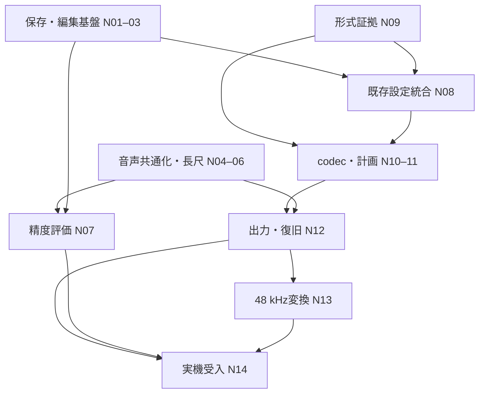

# Auto Slice 残実装の詳細計画

状態: **設計案／未実装**。作成日: 2026-09-08。
対象は検出設定の保存・範囲編集、長尺音声、実音楽評価、既存設定統合、`.ot`出力と実機受入。
文書名の「2」は計画の続編を表し、検出algorithmのversion変更ではない。

## 1. 基準と完成の定義

基準はfork main `827c7c5252f8ac8daf484b372202315845fdaf31`（[PR #102](https://github.com/kaz4g/masterocta/pull/102) merge）。
[AUTO-SLICE-1技術設計](AUTO_SLICE_1_TECHNICAL_DESIGN.md)の座標・DSP・媒体安全契約を引き継ぐ。
現行機能は[実装状況](AUTO_SLICE_1_IMPLEMENTATION_STATUS.md)を参照する。
以下の数値で「目標」「提案」と記したものは測定結果ではない。

| 項目 | mainでできること | この計画の完成条件 |
| --- | --- | --- |
| 設定と編集 | 境界・固定・削除記録はSQLite v7に保存。検出設定はセッション内。同一sourceのROI変更は拒否 | 解析を開始せずドラフトと設定を復元。別ROIの編集案を保持し、古い候補を誤適用しない |
| 長尺 | 元ファイル64 MiB、ROI 10分、解析PCM割り当て256 MiB | 入力2 GiBまで。検証済みディスクsnapshot、分割PCM、cache自動回収、実測性能を備える |
| 精度 | 合成アタック・逆相・境界などの回帰試験 | 権利確認済み100 clip、凍結holdout、注釈・誤検出・検出漏れ・手直しの再現可能な報告 |
| 既存設定 | `.ot`/slotのread modelと自動連続draftが別々に存在 | 所有者と元bytesを保持し、個別end・gap・重複・loopを意味が確認できた範囲で編集 |
| 出力 | draftまで。媒体Applyなし | 証拠のあるprofileに限定した新規audio＋`.ot` variant、復旧試験、対象実機の受入記録 |

並行する[PR #103](https://github.com/kaz4g/masterocta/pull/103)は確認時点でopen、head
`6fe5b4f81edac21de7e93afeceabead6eb976894`。波形範囲API、2 GiBの私有snapshot、
peak cache、区間試聴を追加しているが、#102後のmainとの統合は未完了とPRに記載されている。
その[固定headの設計](https://github.com/kaz4g/masterocta/blob/6fe5b4f81edac21de7e93afeceabead6eb976894/docs/planning/WAVEFORM_2_IMPLEMENTATION.md)
を接続候補とし、統合PRで実際のmerge後APIを再確認する。#103の旧baseでのCI成功を統合後の証拠に流用しない。

完成を三段階に分ける。

- **編集完成**: 設定復元、ROI分岐、長尺処理、既存設定の非破壊編集まで。
- **出力実装完成**: codecと回復可能な新規variant出力が合成・由来付きclone試験を通過。
- **対象実機で使用可能**: 指定した機種・OS・入力形式の実機受入が通過。別OSや公開配布の承認へ拡張しない。

M6 Portable ProjectとM7 Sliceの既存milestone区分は変更しない。
既存音声の上書き、Project/Bank/markers文書の書き戻し、slot一括置換は初回出力に含めない。

## 2. 共通構成と不変条件

### 2.1 永続データ、音声セッション、解析を分離する

現行`slice_workbench::Ready`はPCM・解析結果・draft操作を結び付けている。
これを三つの寿命へ分ける。SQLiteの保存完了はFFTの成功やcacheの存続に依存させない。

| 概念 | 所有するもの | 寿命／正本 |
| --- | --- | --- |
| `SliceDocument` | owner、source binding、ROI、境界、設定、受理済み結果のprovenance | ローカルSQLite。cache回収・rescan・再起動で消さない |
| `AudioSession` | 検証済みsnapshotのlease、形式情報、PCM range reader | root/windowに束縛された期限付き能力。永続IDを権限にしない |
| `AnalysisRun` | feature key、実行世代、処理状態、候補一覧 | 一時データ。失効後は再解析可能。確定markerを再計算しない |

共有音声経路は`audio_runtime.rs`と`slice_workbench.rs`のcomposition rootから注入する。
波形・試聴・onsetごとに同じ元音声を別snapshotへコピーしない。
`ot-audio`はDSPと音声変換、`ot-domain`は純粋な編集規則、`ot-catalog`はtransactionを担当。
`ot-application`はstorage/codec port経由で調整し、具体的な音声・SQLite・Tauri adapterへ依存させない。
cache filesystem adapterは外側に置く。必要なら小さな`ot-local-storage` crateを追加するが、
先に依存図とarchitecture guardへ反映し、既存guardの除外で通さない。

### 2.2 座標・同一性・競合

- 全編集座標は元音声のPCM frame、`u64`、半開区間`[start,end)`。IPCは正規10進文字列、UI演算は`BigInt`。
- DBのframe列はTEXT。SQLの文字列順序でframeを比較せず、decode後の整数検証と保存ordinalを使う。
- 新しいdocument APIのrevisionも10進文字列にする。現行数値revision DTOは移行adapter内に閉じ、UIの丸めを許さない。
- source bindingはroot fingerprint、検証済み相対path、SHA-256、sample rate、frame count。
  session `RootId`とabsolute pathはDBへ保存しない。同じcontent hashでもownerが違えば別document。
- frontendから渡されたdocument IDだけで読まない。毎回live RootRegistryとownerの所属を照合する。
- sourceの変更時は旧documentを残して`sourceChanged`表示。旧座標を新音声へ自動移植しない。
- ownerの元設定hash変更は`ownerChanged`。音声hash一致でも既存設定の編集・出力を無条件に継続しない。
- document更新は`expectedRevision`のCAS。conflict時は現在revisionと再読込導線を返し、自動上書きしない。

## 3. 検出設定の保存と範囲編集

### 3.1 保存契約

一つのdocumentに「現在選んだ設定」と「最後に候補を受理したときの設定」を別々に保存する。
感度を変更しただけで、確定済み境界の由来が新設定に置き換わってはならない。

| 保存値 | 内容 |
| --- | --- |
| `draftId / revision / parentDraftId` | 不透明な永続ID、CAS revision、ROI変更や複製の親 |
| `ownerBinding / sourceBinding` | 第2節・第6節の所有者、元設定documentのhashとparser provenance |
| `region / layout / markers` | ROI、連続自動／個別区間、start/end/loop、固定・手動・削除記録 |
| `requestedRecipe` | params schema version、algorithm ID、全検出設定。現在のUI選択の正本 |
| `acceptedRun` | 受理時recipe、source/feature/proposal digest、decoder build、数値profile、受理日時、候補由来 |
| `derivation` | 複製・ROI変更・取込元・明示変換の由来。元documentは残す |

初期設定は現行の感度50、最小間隔35 ms、pre-roll 1,000 µs、floor −72 dB、snap 0 µsを維持。
入力範囲も現行domain validatorを使う。未知のrecipe versionを現行defaultへ黙って変換しない。
読み取りと手動編集は可能な状態を区別し、再解析には対応recipeの明示選択を必要とする。
プリセット名だけを保存せず、全値とversionを展開して保存する。利用者向けプリセット管理UIは後続でよい。

v7には受理時paramsがないため、移行時の`acceptedRun`は`legacyUnknown`とする。
初回UI用の現行defaultは`defaultAssignedOnMigration`として区別し、過去の解析条件と表示しない。
既存marker ID、整数frame、lock/manual、candidate ID、除外区間、revisionはそのまま保持する。

### 3.2 Schema移行

次の空きmigration番号を実装時に確保する。v7のunique制約
`(root_fingerprint, relative_path, source_hash)`は複数案を妨げるので、新document表へのtransactional移行を行う。

| 表の案 | キー／内容 |
| --- | --- |
| `slice_documents` | draft ID、owner/source binding、parent、ROI、layout、revision、更新時刻 |
| `slice_document_recipes` | draft ID＋role（requested/accepted）、version付き値とprovenance |
| `slice_document_markers` | draft ID＋marker ID、ordinal、start、end mode/explicit end、loop、lock、provenance |
| `slice_document_suppressed / exclusions` | draft ID、algorithm namespace付き候補ID／元frame範囲 |
| `slice_document_origins` | 元設定hash、codec profile、取込bytes参照、raw status |

scan projectionのFK cascadeに接続しない。import元bytesはcacheとは別の永続ストアへdigest付きで保存する。
小さなsidecar bytesはDB BLOBでもよいが、型別上限を設け、サイズ不明のProject全体を無制限に複製しない。
任意長JSON一列に編集モデルを押し込まず、frame・owner・markerは型付き列で検証する。
recipeのschema付きJSONを使う場合は長さと全fieldをadapterで検査する。

移行はDBの整合したbackupを取得し、全行copy・件数と値の検証・schema version更新を一transactionで行う。
不正な旧行があれば全体rollbackし、行の黙殺や自動補正をしない。旧appによる新schema書き込みを拒否する。
新旧writerを同時に残さず、旧APIは新storeへ委譲する短期adapterとし、移行完了後に除去する。
migrationテストは空DB、編集済みv7、複数root、最大frame、故障注入、再実行、旧版拒否を含む。

### 3.3 操作と保存順序

1. Inspectorを開くとdocumentとrequestedRecipeをDBから取得する。FFTを走らせず既存markerを表示。
2. 設定変更はローカル表示に即反映し、単一の保存queueでCAS保存。UIに保存中／保存済み／失敗を表示。
3. 解析要求と画面遷移は保存queueをflushして結果を待つ。保存失敗時は未保存値を保持する。
4. 自動候補更新は最新世代だけを表示する。確定markerは「候補を反映」でのみ変更。
5. 反映transactionでmarkerとacceptedRunを同時保存し、どちらかだけの更新を作らない。

設定変更の連打はcoalesceするが、無期限に保存を先送りしない。提案値はtrailing 50 ms、最大待ち250 ms。
pointer-up、Enter、解析開始は即flush。異常終了で未保存だった最後の操作まで復元できるとは約束しない。
再起動後に「保存済み」と表示した状態が一致することを受入条件とする。
Undo/Redoは当面document編集セッションの最大20操作。履歴の再起動復元は対象外だが、現在の確定状態は必ず残る。
Undoも新revisionを作り、設定・marker・provenanceの整合したsnapshotへ戻す。

### 3.4 ROI変更は元案を残す分岐にする

`viewport`（表示範囲）、`selection`（選択／試聴範囲）、`analysisRegion`（documentの解析対象）を分ける。
ズーム、スクロール、試聴範囲の変更はROI変更でも設定保存でもない。

ROI変更の既定動作は**新しいdraftを作る**。`parentDraftId`と親revisionを記録する。
入力は`0 <= start < end <= frameCount`かつ10分以下。適用前に以下の差分を表示する。

| 対象 | 新ROIでの処理 |
| --- | --- |
| 共通範囲内の手動・固定marker | IDと元frameを保持。startだけ入ってestimatedAttackが外になる場合は由来を保持できるモデルで扱い、v7 validatorへ押し込まない |
| ROI外のmarker | 新案へコピーしない。元案には保持し、件数と対象を事前表示 |
| 自動marker | 共通範囲内は暫定保持。再解析・明示反映まで勝手に移動しない |
| 除外区間 | 新ROIとの積集合をコピー。候補IDは同一source/algorithm namespaceの場合だけ再利用 |
| 新しく含む範囲 | 未解析として表示。ROI開始に人工的なhitを追加しない |
| 個別end/loopを持つ取込設定 | 範囲外へ切れるsliceを自動短縮しない。元の個別区間案を残すか、新しい自動案を作る |

新案は元音声の絶対frameを維持し、ROI先頭を0へrebasingしない。
連続自動案の末尾endだけは新ROI終端となるため、末尾slice長の変更を差分に含める。
親CAS照合・子作成は一transaction。親の同時編集、古い解析完了、source切替による子の誤作成を拒否する。
子作成には永続`derivationRequestId`のunique制約を置き、応答消失・再起動後の再送でも二重作成しない。
同じrequest IDに異なる親revisionやROIが来た場合は拒否する。

### 3.5 API案と失効条件

以下は追加・移行するAPI案で、現行公開APIに実装済みという意味ではない。

| API案 | 入力の中心 | 結果／制約 |
| --- | --- | --- |
| `v2_slice_session_open` | rootId、fileInstanceId、ownerId | 照合済み編集session、document一覧。解析不要 |
| `v2_slice_document_get` | sessionId、draftId | 永続状態、availability、編集能力 |
| `v2_slice_document_update` | sessionId、draftId、expectedRevision、typed edit、requestId | CAS後の状態。設定／手動編集／候補受理を型で区別 |
| `v2_slice_document_fork_region` | 親ID/revision、新ROI、確認済み差分digest | 新案と保持・除外一覧 |
| `v2_audio_onsets_start/status/cancel` | 編集session、draft/revision、recipe digest | 既存commandをadapter移行し、音声jobとdocumentを分離 |
| `v2_slice_proposal_page` | proposalId、cursor、limit | 同じ不変proposal内の候補・抑制理由。最大200件/page |

requestIdはsession内で再送結果を返すために使用し、同じIDで異なるpayloadを拒否する。
marker更新のDB transaction後に応答が失われても、再読込で結果を確定できる。
restart後のrequestId再送で同じ編集を無条件に再適用しない。

proposalは`sourceHash + ownerBindingDigest + draftId + revision + ROI + recipeDigest + analysisGeneration`
に束縛する。受理時に全て照合し、生成後の設定・手動点・ROI・owner変更で失効する。
page cursorもproposal世代に束縛し、別jobの候補を混在させない。4096超過をpagingで隠さず、全体反映を拒否する。
削除候補IDはalgorithm versionを跨いで照合せず、同一source上の除外frame範囲は維持する。

## 4. 長尺音声と資源管理

### 4.1 対応範囲と予算

「長いファイルから10分以内を解析する」を最初の到達点とする。
2 GiB全体への自動一括スライスや無制限の候補保持は別機能。
既存のWAV/AIFF、16/24bit、mono/stereo、44.1/48 kHzという入力契約を維持し、
RF64、extensible、AIFC、floatへの拡張を制限解除と混ぜない。

| 資源 | 設計上限／目標 | 実装上の扱い |
| --- | --- | --- |
| 元音声 | 2 GiB/file | header宣言と実byte長を照合。超過を途中切捨てしない |
| 解析範囲 | 10分＋前後500 msの実context | 全frameをfloat PCMで保持しない |
| 共有音声cache disk | 4 GiB合計 | snapshot、waveform peak、features、tmpと予約を全て計上。backup・draftは別管理 |
| waveform peak disk | 256 MiB合計、64 MiB/entry | #103の上限を共有4 GiB内のsub-budgetへ統合 |
| 解析worker | 全アプリ1件 | queued要求も上限を設け、古い未開始世代を置換 |
| PCM decode block | 65,536 framesを初期案 | stereo float32で512 KiB。ring/contextと別に見積もる |
| 解析追加RSS | 128 MiBを目標 | アプリidleとの差を実測。OS全体／全app RSSの保証とはしない |
| 管理対象live allocation | 256 MiB ceiling | 解析、PCM、試聴、DTO一時copyまで予約。個別allocationのみの上限にしない |
| 試聴 | 30秒、float32 16 MiB、token最大2件 | 保存形式は元frame、frontendへ全音声を送らない |
| 候補 | raw 32,768、編集4,096、出力64 | 各段階で独立に検査。上限超過時に黙って間引かない |

48 kHz stereoの10分をfloat32化すると230,400,000 bytes（約219.7 MiB）になり、
PCMだけで128 MiB目標を超える。したがって上限値だけを変更する実装は採用しない。
一方hop128の10分は225,000 feature frames。現行24 bytes相当なら約5.2 MiBで、
統計・scratch・alignmentを含む特徴量予算を32 MiBとする。実structサイズは実装時に測る。
常駐peakを全entry分展開せず、必要なLOD/rangeだけを読み、PCM ringと短区間LRUは計16 MiBを初期予算とする。
試聴は旧AudioBufferの参照を解放してから次を組み立て、token二件を同時に全量PCMへ展開しない。
native側のallocation計上とWebView側のArrayBuffer/AudioBuffer実測を分け、copy中の二重保持もpeakへ含める。

### 4.2 Snapshotの取得と共有

1. RootRegistryとfileInstanceから安全なread-only descriptorを開き、元identityと期待hashを固定する。
2. cache managerが必要byte数を予約。空き不足ならunpinned LRUを回収し、なお不足なら開始前に失敗。
3. App Supportの専用tmpへstream copyしながらSHA-256を計算。中断をblock間で確認する。
4. 実サイズ、完全なcontainer構造、全sample payload、元descriptorの前後identity、live rootを照合する。
5. bytesとmanifestを同期し、完成記録を最後にpublishする。完成印のないentryをcache hitにしない。
6. digest単位のentryをleaseで共有。waveform/preview/onsetは別の所有者でも、認可確認後に同じbytesを使える。

snapshot keyは元のencoded bytesのSHA-256。decoded PCM全体をdiskへ展開して2 GiBを膨らませない。
file layout manifestにformat、sample rate、channels、bit depth、data offset/length、frame count、
validator/decoder versionを持たせ、checked arithmeticでframe→byte rangeを計算する。
対応する整数PCM containerでは検証済みdata extentへの範囲読取を行い、byte order・24bit符号拡張を固定する。
新range readerの出力は既存decoderとのgolden比較で確認する。未知のchunk構成は推測seekしない。

#103で記録されたAIFF SSNDのdecoder互換補正は、元snapshotのhashと混同しない。
元bytesを保存し、必要な補正はversion付きprivate decoder viewに限定する。
末尾SSND・後続metadata・padding・宣言frame不一致の既存回帰を両経路で残す。
ROIより後の破損を無視してreadyへ進めない。完全検証が終わるまではdraftへの候補受理を開かない。

cache hitでも新しいAudioSessionを開く際にlive sourceを再hashして照合する。
同じsessionの範囲読取は検証済みsnapshotを使い、各blockで元媒体を再hashしない。
root失効、外部変更の観測、明示refresh時はsessionを失効させる。
既に読んだsnapshotへの編集は内容固定の作業として区別できるが、媒体Apply時のfresh hashを代替しない。
長いsource検証中のroot解除・window破棄では完了結果を公開せずleaseを解放する。

### 4.3 Streaming DSP

`OnsetAnalysis`から`PcmRegion`全量所有を外し、`FeatureSet + PcmRangeReader`へ分ける。
DSPパラメーター、global frame 0基準のhop128、centered Hann、帯域、左右max、
median/MAD、refine後RMS gate、pre-rollとNMSの順序はこの改修で変更しない。

- 第1段: block＋overlap ringでFFT。window中心をglobal hop gridで列挙し、chunk先頭で位相をリセットしない。
- 第2段: 保存した帯域fluxに前後200 msの統計窓を適用。隣接bin・前frame・ピーク窓のhaloを確保する。
- 第3段: ROI候補とprotected境界を評価し、refine/snapに必要な小区間をframe順にまとめて読取。
  近接した要求はmergeし、候補ごとの全体decodeや32,768回の遠距離seekを避ける。
- 第4段: refined attackのROI所属、silence gate、pre-roll、quiet snap、NMSを適用。整数の受理結果を保存。

500 ms contextは実音声の範囲内で取る。真のファイル端だけを既存edge規則で扱い、
chunk端やROI端に人工的な無音を作らない。現在の全量実装を小fixtureの比較oracleとして残し、
chunkサイズ1、hop±1、65,536、不揃い終端でも同じ整数markerになることを回帰試験する。
float計算順が変わる実装はnumeric profileを更新して差分を測り、全CPUでのbit一致を未検証のまま保証しない。

feature keyはsource hash、PCM契約、decoder build、algorithm/kernel digest、FFT/hop/window/bands、
global origin、coverage/context policy、numeric profile。閾値だけの変更はfeaturesを再利用する。
recipe digestは感度、最小間隔、pre-roll、floor、snapなど全値を含む別keyとする。

### 4.4 自動回収、キャンセル、障害

cache状態は`Reserved → Writing → Verified → Leased → Evictable`。
reservationは同時要求間で原子的に計上し、tmp＋完成fileの二重容量もpublication手順に応じて見積もる。
同じhashのbuildはsingle-flightにまとめる。4 GiB制限下では2 GiB二本が常に共存できるとは約束しない。

- active lease中は削除しない。UIは不要なlease/tokenをclose、source切替、cancelで解放。
- idle session期限は最終利用から15分、preview tokenは120秒。実行中workerのheartbeatはidle期限と分ける。
- 起動時・60秒ごとのsweep・予約不足・root解除で回収を走らせ、アクセスが来ない期限切れjobも解放する。
- crash後のtmp/manifest不整合は専用cache配下で検証して回収。symlinkや不明なentryは辿らず隔離状態にする。
- sweepとreaderはlease lockで調停。認証済みbackup、import元bytes、draft DBはLRU対象にしない。
- cancelはcopy block、FFT batch、統計batch、refine、publish直前に確認する。
  `spawn_blocking`のhandle破棄だけで停止した扱いにしない。OS I/O停止時の即時cancelは保証しない。

UI状態はhashing/copying/validating/analyzing/ready/failed/cancelledを分ける。
既知の総byte/frame数をprogress denominatorに使い、I/OとDSPの待ち時間を混ぜて表示しない。
試聴と可視範囲の読み込みを短いbatchで優先し、解析をUI threadや長時間のcatalog lock内で行わない。

### 4.5 性能の測り方

Mac機種、RAM、OS、release build SHA、形式、保存媒体、cache状態、サンプルhashを記録する。
cold取得／検証、warm session、warm featuresを別に最低30回測り、p50/p95/max、追加RSS、disk peak、
cancelから資源解放までの時間を出す。coldのsource I/O時間を隠してDSP時間だけを全体時間と呼ばない。

既存目標は30秒解析p95 1秒、10分p95 10秒（snapshot検証後）。感度変更はUI操作から候補表示p95 150 ms。
現行180 ms debounceでは後者を満たせないので、第3節の50 ms coalesceへ変更し、DB・queue・DSP・IPC・描画を含めて測る。
warm試聴p95 50 msは検証済みsessionと必要PCMがある場合の入力→audio scheduling。
range取得が必要な場合と実音声出力latencyは別系列で報告する。未達時にsource検証を省かない。
操作要求からcancel flagの確認までp95 100 ms、通常のlocal I/Oで資源解放まで1秒以内を追加目標とする。
停止した外部I/Oを含む最悪値は別報告し、timeout後も実行中workerを二重起動しない。

## 5. 実音楽での精度評価と調整

### 5.1 Corpusと注釈

100 clipを、合成／単発20、clean drums 30、残響・飽和20、混合音楽15、無音・noise・非打撃15に分ける。
調整60／holdout40は`sourceFamilyId`単位で分割し、元loopの速度・gain・残響variantを跨がせない。
各カテゴリが両splitに含まれるよう割当manifestを固定する。楽曲の権利が未確認なら取得や公開を自動化しない。
公開repoには再配布可能な素材だけを入れ、非公開評価素材はhash・ライセンス・取得手順と集計結果で追跡する。

manifest案: `clipId, sourceFamilyId, sha256, format, sampleRate, frameCount, split, tags,
license/provenance, transformRecipe, annotationVersion, annotator, reviewStatus`。
音源pathは評価runnerのローカル設定に置き、manifestへ個人環境のabsolute pathを入れない。

注釈は二層にする。

1. **音響attack**: 元frameのpoint、曖昧なら許容interval、event ID、楽器tag、重なりgroup。
2. **望むslice開始**: 演奏上の開始位置／許容interval。pre-rollの良否をattack検出と混同しない。

同時に鳴る複数楽器は「一つのslice境界」というtarget policyにまとめ、分離可能なflam/rollは別event。
最小間隔より近い打音も原注釈から削除しない。二人のreviewが難しい場合は別sessionで再注釈し、
不一致をadjudication欄に残す。モデルの候補を見ながら正解位置を動かさない。

### 5.2 Metricsと採否

±10 ms以内をedgeとする最大cardinality一対一matchingを行い、同数なら総絶対誤差最小、
同値ならevent/候補ID順で決定する。複数候補で一つの正解を重複加点しない。
point基準の主指標と曖昧interval対応の補助指標を別表示する。

| 指標 | 判定／報告 |
| --- | --- |
| Clean onset | holdout clean subsetのmicro F1 ≥ 0.90。precision/recallとclip macroも併記 |
| 開始位置 | cleanの対応した境界の95%以上がattackに対し−8〜＋2 ms。対応しなかったFNを別計上 |
| 編集負担 | 追加／削除／移動を別count。cleanで合計編集数÷max(正解数,1) ≤ 0.15を目標。分母を固定して比較 |
| Negatives | 無音のFP=0。noise／非打撃はFP/minとclip別分布を報告 |
| 難例 | 弱打・roll・残響・低音＋hatのprecision/recall、誤差、手直し率を独立報告 |
| 安定性 | 逆相化、gain variant、ROI/chunk境界、44.1/48 kHzでfamilyごとの差分を確認 |

「音響event全体へのrecall」と「選択した最小間隔規則を適用した出力」を併記する。
間隔設定が原因の抑制とDSPの検出漏れを分け、密なrollを評価母集団から除外してF1を改善しない。
小subsetは件数とfamily単位bootstrap区間を表示し、一つの総合F1で難例の劣化を隠さない。
初版の混合／残響subsetに未実測の0.90保証は置かない。

### 5.3 調整手順と回帰

- baselineは`onset:drum:v1`、固定recipe、固定buildと全候補・抑制理由を保存して測る。
- 弱打: 局所floor／MAD床の影響を調べる。roll: peak幅／同一rise判定／最小間隔を分ける。
- 残響: 後続fluxと新attackを誤認したcaseを採取。低音＋hat: 高域noveltyが合成scoreに埋もれるかを調べる。
- 一度に一つの仮説を変更し、帯域maxなし・refineなし等のablationで効いた段階を確認する。
- tuning splitだけで探索し、clean precision/recallの片方だけを犠牲にした改善を採用しない。
  algorithm/kernelを変えたらversionを上げ、受理済みdocumentはそのまま保持する。
- holdoutはrelease候補の判定時に使用。失敗例を調整に使う場合は旧holdoutを退役し、新holdoutを作る。

runnerは入力hash、algorithm/recipe、seed、numeric profile、metrics version、注釈version、
結果JSON/CSVと人間向けMarkdownを出す。診断波形は必要caseだけ出力し、録音全体を無断公開しない。
CIには権利が明確な小型golden corpusと不変条件を置く。100 clip評価は固定release buildで実施する。
現時点で100 clipの収集・人手注釈・実測は未完了。runnerと合成fixtureは先に実装できる。

## 6. 既存スライス・ループ・Project設定の統合

[所有権の正本](../domain/OCTATRACK_STATE_AND_SAMPLE_SEMANTICS.md)に従う。
`AudioAsset`単位で設定を統合せず、同じ音声を使う複数slotの違いを残す。

### 6.1 Ownerと取込状態

| Owner | 永続bindingの中心 | 編集時の表示 |
| --- | --- | --- |
| file sidecar | root fingerprint、audio/sidecarの相対path、両hash | ファイル保存設定のどのrevisionから派生したか |
| slot assignment | root、Project locator、文書kind/Working・SavedCheckpoint、Flex/Static、slot identity、関連settings/markers文書hash | Project、machine、slot、Working/Savedの由来 |
| 新規案 | source file binding、親document任意 | 新しいvariantへ出す独立したdraft |

opaqueなcatalog row IDだけを永続locatorにせず、rescanで再照合可能な型付きownerを保存する。
same-stem WAV/AIFF、複数sidecar候補、slot参照未解決ではownerを推測しない。
Working/Savedやfile/slot間の優先順位は自動選択せず、別entryとして比較・選択する。
rename後の追従は検証済みrename結果の明示mappingだけで行う。同hashの別pathへ勝手に付け替えない。

raw read modelの`Parsed`は編集・出力の許可と同義ではない。
`RawObserved / SemanticsVerified / Editable / ExportEligible`を能力として分け、
未知のend/loop意味論はraw値と由来のみ表示し、数値をそのまま波形座標へ変換しない。

### 6.2 二つのlayout

- `ContiguousAutomatic`: 現行と同じ開始点列。endは次marker、最後はROI終端。新規loopはdomain上`None`。
- `ExplicitImported`: 元ordinal/index、start、個別end、slice loop、sample trim/loop、属性を保持する。
  gap・重複・異なるendを許す。表示の並べ替えで実機indexを書き換えない。

loopは意味が検証済みの`Disabled / Frame(frame)`と、未解釈のraw状態を区別する。
全体loopとslice loopも別field。無効sentinelの値はprofileで確定するまで定数化しない。
元bytesとraw fieldは常に保存し、roundtripが必要なunused slotやunknown領域をゼロ化しない。

編集操作は`MoveStart / SetEnd / SetLoop / DisableLoop / SetLock`を分離する。
endを短縮してloopが範囲外になる操作は失敗し、loopを黙って消さない。
位置関係のvalidatorは証拠のあるprofile規則を使う。単なる表示上の補正で保存値を変えない。
start変更で隣sliceのendが連動するのは連続自動layoutだけとする。

Imported案へ自動候補を反映する初期UIは「別の自動案を作る」。元のslice index/end/loopを保持する。
自動案への変換で失われる属性一覧を出し、元案と比較できるようにする。
個別区間に自動開始点だけを混ぜる複雑なmergeは後続の明示操作とし、初版では暗黙変換しない。
slot由来の設定を新sidecarへ移す場合もfield対応が検証できたものだけを提示し、
表現できない属性は明示除外か出力blockerにする。slot自体への書き戻しには別codecと別Intentが必要。

## 7. `.ot` codec、出力、実機受入

### 7.1 形式の証拠を先に固定する

以下は未確定事項を解消する作業であり、推測したoffsetやchecksum式を実装する指示ではない。
[Format Evidenceのsource policy](../../.agents/skills/masterocta-format-evidence/references/source-policy.md)
に従い、公式の操作説明、由来付きfixtureで再現した観測、既存reader実装、仮説を分ける。

`OtFormatProfile`はprofile ID/version、機種と正確なOS、fixture hash集合、
確認済みfield/byte範囲、frame変換、checksum規則、対応操作、未解決事項を持つ。
設定profileのhashをplanへ固定し、後から別profileで同じplanを実行しない。
名称案は`docs/testing/AUTO_SLICE_OT_FORMAT_EVIDENCE.md`とversion付きfixture manifest。
profileごとに単なる「対応OS」文字列ではなく、read・edit・new-template・patch・exportの能力を明記する。

| 証拠項目 | 対照fixture／確認 |
| --- | --- |
| header、長さ、version、endian | 正常・破損・未知version、複数の既知値を持つ対照 |
| frame対応 | 先頭、1 frame、既知attack、最終frameと終端。end inclusive/exclusiveを切り分ける |
| slice数／index | 0/1/63/64、65拒否、UI SL1とraw index。0の意味が未確認なら0出力は閉じる |
| endと重複 | gap、overlap、個別長、最終slice、no-op保存 |
| loop | disabled、有効、境界値、全体とslice個別の組合せ |
| checksumと保持領域 | 一項目だけ変更したbefore/after、unused slot、unknown bytes |
| source／owner | sidecarなしの初期template、既存sidecar、slotのWorking/Savedの差、再読込時の挙動 |

fixtureには作成操作、app/device/OS version、hash、期待差分、権利と由来を記録する。
一つのfixtureから全OSへの互換性を推定しない。既存Projectのcompatibility exceptionやGate C通過は、
新しい`.ot` writerの証拠を代替しない。

### 7.2 Pure lossless codec

codec portは`inspect(bytes, profile)`と`plan_patch(originalDocument, typedPatch, profile)`を提供する。
出力はbytes、変更field、許可byte-range、保持領域digest、checksum検証、意味付き差分。
filesystem書き込みやRootId解決をcodecに持たせない。

no-opは元bytesと完全一致。変更は検証済みfieldとそれに必要なchecksum/countだけに限定し、
変更後decodeの一致と許可範囲外byte不変を検証する。reader/writerで同じ誤解を共有しないよう、
実機が保存したgolden bytesとの比較を必須にする。
新規`.ot`は由来と再利用条件を確認したtemplateから作る。既存sidecarなしをゼロ埋め生成の理由にしない。
profile不一致、未知loop、checksum不明、owner曖昧は出力不可だが、独立した新規draftの解析は続けられる。

### 7.3 初回出力は新規variant

`ExportSliceVariant` Intentは元audio全fileのbyte copyと新しい同stem `.ot`を作る。
ROIだけのcrop、normalize、bit-depth変更、既存file置換、Project参照変更は含めない。
同じaudio hashなら新`FileInstance`と設定revisionを登録し、同一contentの`AudioAsset`を重複生成しない。
出力先のtrimや再生範囲にROIを対応させる場合もprofileで検証し、音声cropと取り違えない。

48 kHzは解析できるが初回exportはblockする。44.1 kHzへの変換を別Intentで明示し、
新asset・変換recipe・元hashを保存してから再解析する。単純なframe比率移植は行わない。
変換は専用の実装PRでresamplerのdelay、端点、長さ、clipping、dither方針を検証する。
未検証のslot設定を自動で変換先へ移さない。

### 7.4 Plan・承認・Apply

Planにdraft ID/revision、source hash/size/format、owner元設定hash、profile digest、
確定した整数slice配列、出力`.ot` bytes/hash、root fingerprintとscan revision、
全target相対path、既存path不在、名前衝突検査、settings diff、backup/staging容量、postconditionを固定する。
64超過、未解決参照、未対応profile、raw不明値、48 kHz、容量不足をblockerとして一覧表示する。
既存source用のNMSや再解析をApply中に再実行しない。
適用開始時にdocument revisionとimmutable export snapshotを原子的に固定する。
同じdocumentへの更新はapply coordinatorで`DocumentBusy`にし、別案作成は許可する。
長時間のfilesystem処理中にSQLite write transactionを保持する方式にはしない。

初回の出力名はユーザーが確認する新stem。大文字小文字、Unicode正規化、同stemの別audio拡張子、
孤立`.ot`、既存missing slotが新pathを参照している場合まで衝突検査する。
安全性判断に必要なusage graphを解析できないrootは媒体出力を閉じる。

1. **Plan**: read-onlyで差分とblockerを作成。許可される内容をUIで確認できる。
2. **Authorize / Backup / Prepare**: このoperation専用の承認を取得し、元audioと必要な元設定を
   Mac側へbackupして再hash検証。出力bytesをstageし、immutable plan recordとdurable journalへ束縛する。
3. **Apply**: cross-domain mutation gateとroot writer lock取得。live root、fresh source/settings hash、
   draft revision、出力先不在、空き容量を再照合。媒体stageへcopy・同期・再読込検証。
4. **Publish**: audio、続いて`.ot`をno-replaceで公開し、各identityとhashをjournalへ記録。
   一時的に片方だけが見えるため、両方検証されるまでUIは完了を表示しない。二fileのatomicityは約束しない。
5. **Verify / Commit**: 両fileを媒体から読んでhash・codec・slice意味を照合。durableなCommittedを記録。
6. **Refresh**: fresh rescanで新FileInstanceとsidecarを照合。失敗は`CommittedRefreshRequired`とし、書き込み再実行を誘発しない。

既存additive-copy／renameのauthority tokenや`planId`を流用しない。
共通のverified backup、no-replace、writer lock、journal検証primitiveだけを再利用する。
未完了rename、copy、slice exportのどれでも相互に新mutationを止める。
prepare済みplanをrestart後に表示できても、過去の承認だけで自動Applyしない。

### 7.5 中断・再起動・回復

| 永続状態 | 許される操作／中断後の扱い |
| --- | --- |
| Planned | 媒体変更なし。再計画／破棄可能 |
| Prepared | verified backupとstageあり。再照合＋現在の専用authorityで継続、または未公開stageの安全な取消 |
| Applying（公開0/1/2件） | journalとplan recordから作成物を照合。安全点でrollback、または検証完了へ進む |
| RecoveryRequired | 新writeをblock。root／backup／作成物の同一性を確認して専用recoveryへ |
| Committed / CommittedRefreshRequired | Apply再実行不可。read-only検証／catalog refreshのみ |
| RolledBack | 元audio・設定不変と自作出力の除去を検証した終端 |

publish直後・journal追記前のcrashも扱う。path名一致だけを削除根拠にしない。
recovery対象は認証済みplan/backup binding、作成時identity、期待hashで照合し、
no-replaceでoperation固有quarantineへ移して再検証してから回収する。
外部processが置換したfile、identityを証明できないpartial、改変されたjournalは保持して復旧待ちにする。
二file目の失敗で、一file目を無条件に削除する補償処理を作らない。
cancelはPrepared以前なら媒体変更なし、Applying以降は即座にworkerを止めず安全点まで進める。

### 7.6 実機受入

対象は由来確認済みの使い捨てcloneと、明示したOctatrack機種・OS。
fixture準備、codec golden、transaction fault試験は先に実施できる。
実機へのload・SAVE/RELOAD・演奏確認は操作者の測定記録が必要で、自動テスト通過から推定しない。

各対応containerについてmono/stereo × 16/24bit × 1/63/64 slicesを確認し、
先頭・中間・最後、gap/overlap/個別end、loop有効/無効をprofileの対応範囲で追加する。
Flex/Staticの空slotへ読み込み、表示数・開始/終了・再生attack、SAVE/RELOAD後と再mount後の保持を記録する。
短い既知信号を使用し、時間表示だけで判断せず既知attackと聴感／記録波形も照合する。
試験前後manifestで、元audio・元`.ot`・対象外Project/Bankが不変であることを確認する。
実機のSAVE操作による許容変更はMac側exportの変更と分けて記録する。

記録はapp SHA、codec profile、device/OS、fixture hashes、操作手順、期待／実際、PASS/FAIL、
操作者、日付、未対応条件を持つ。失敗caseのprofileは閉じ、対応済みの狭い範囲だけを維持する。
実装時に`docs/testing/AUTO_SLICE_DEVICE_ACCEPTANCE.md`へ手順と記録templateを追加する。

## 8. 実装順序とPR単位

`AS-Nxx`はこの残実装計画のID。AUTO-SLICE-1のAS-0〜AS-7を完了扱いに書き換える番号ではない。

N14は44.1 kHzの範囲ならN13前に実行できる。48 kHz入力からの完成経路を宣言する際はN13も必須。
N09の証拠収集とN07の素材準備は最初から進められ、N01〜06を実機待ちにしない。

| PR単位 | 主な変更箇所／成果物 | 依存 | 出口条件 |
| --- | --- | --- | --- |
| AS-N01 保存モデル | domain、storage ports、catalog migration。複数document、recipe、由来 | 現行main | v7全値保持、CAS、rescan独立、未知provenanceの明示 |
| AS-N02 編集session | application、slice_workbench、v2_api、API wrapper。jobなしloadと保存queue | N01 | 再起動復元、同時window競合、保存失敗、旧API移行 |
| AS-N03 ROIと候補UI | SliceWorkbench／Waveform連携、ROI分岐、paged proposal | N02、#103接続確認 | 範囲外点の差分、元案保持、stale result排除、2^53超frame |
| AS-N04 共通音声session | #103のaudio_runtime/waveform_v2とPCM readerの共通化、disk manager | #102/#103統合 | snapshot一重化、hash/AIFF回帰、lease、budget、期限回収 |
| AS-N05 streaming onset | ot-audio::pcm/onsets、range reader、features | N04 | 全量oracleとの一致、chunk境界、壊れた末尾、cancel、2 GiB読取 |
| AS-N06 性能・負荷 | scheduler、cache fault試験、Mac benchmark runnerと報告 | N03、N05 | p95/RSS/disk実測、目標との差、previewとの競合、resource leakなし |
| AS-N07 corpus評価 | 注釈schema、runner、golden corpus、必要なalgorithm調整 | 基盤は即開始、最終判定N05 | 凍結holdoutと難例報告、clean gate、設定とbuild再現 |
| AS-N08 既存設定編集 | owner、raw/verified能力、explicit layout、取込UI | N01、N09の該当field証拠 | sidecar/slot別、no-op保持、loop/gap/overlap、未知read-only |
| AS-N09 format evidence | profile、対照fixture、操作記録 | 即開始可 | field単位の根拠と未解決一覧。証拠がない能力は閉じる |
| AS-N10 lossless codec | ot-codec/codec ports、golden・patch試験 | N09 | unknown保持、checksum、端点、count、no-op byte一致 |
| AS-N11 export planning | ot-plan、application、read-only Plan UI | N08、N10 | source/owner/profile/revision固定、diff、capacity、全blocker |
| AS-N12 export transaction | backup/executor、専用authority、journal、recovery UI | N04、N11 | 全crash地点の回復、fresh hash、no-replace、cross-domain gate |
| AS-N13 48 kHz変換 | audio conversionと別Intent、新asset lineage、再解析接続 | N05、N12の安全primitive | 変換長/端点/delay/clipping、原本保持、旧marker自動移植なし |
| AS-N14 実機sign-off | testing文書、対象profileごとの証拠 | N06〜12、48 kHz経路はN13 | clone実機load/再保存/再読込、対象外hash不変、operator記録 |

実装着手は**N01 → N02**から。N04は#103の統合結果を確認してから共有adapterの差分を切る。
N12はread-only planningとは別PRとし、媒体write能力のレビューを分離する。
各PRは自分の出口条件まで完結させ、未測定の性能や未提供の実機証拠を後続PRの成功扱いにしない。

## 9. 横断受入とリリース判定

| 分類 | 必須ケース |
| --- | --- |
| 保存 | 保存済みrecipeのrestart一致、accepted/requestedの分離、CAS競合、disk full、migration rollback、旧版拒否 |
| 範囲 | 1 frame、先頭/末尾、10分境界、縮小/拡大、固定点・削除範囲、undo、新案の親競合 |
| 音声 | 64 MiB境界、2 GiB境界、44.1/48 kHz、mono/逆相stereo、AIFF末尾/metadata、ROI後の破損 |
| 資源 | cache満杯、active entryの非回収、tmp残留、symlink、途中cancel、unmount、複数window、反復close/open |
| DSP | chunk差、global hop、ROI halo、弱打/roll/残響/hat、確定markerの非再計算 |
| 既存設定 | 別owner同hash、Working/Saved、gap/overlap/個別end、unknown loop、同stem曖昧、外部設定変更 |
| codec | no-op完全一致、許可byte以外不変、未知version/破損拒否、0/1/63/64/65、既知実機golden |
| 出力 | stale plan、容量/権限変更、source変更、片方公開、journal各境界でcrash、外部置換、backup改変、二重Apply |
| 統合 | 既存rename/copyとのwrite gate、Committed後のrescan失敗、restart recovery、元audio/設定のbyte不変 |

コードPRでは差分に関連するdomain/storage/audio/UI試験を先に実行し、handoff時に既存のarchitecture、
containment、typecheck、frontend、build、E2E、Rust fmt/clippy/workspace testの適用範囲を確認する。
parser・filesystem・backup・conversion・slice metadata変更には回帰試験を必須とする。
依存変更時のみ関連auditを追加し、実行できない項目は理由と代替検証先を明記する。

この文書を追加するPRはdocs-only。リンク・参照先・差分と設計整合性の検査を行い、
将来のコード試験、100 clipの精度、Mac性能、`.ot`形式証拠、実機受入を実行済みと表示しない。

残る外部入力は、評価に使える音源と注釈、対象OSで作った対照`.ot`、Mac性能測定、実機操作記録。
それらを待つ間も保存・範囲・音声共通化・評価runner・read-only計画を進められる構成とする。
