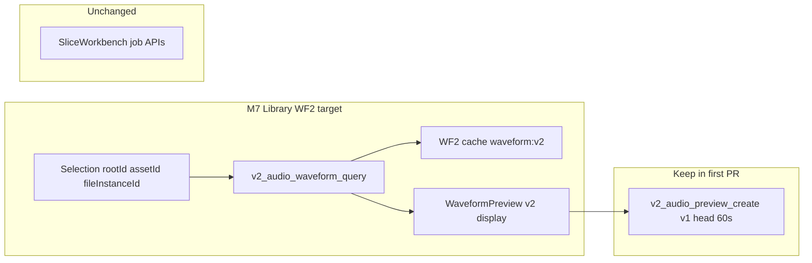

# Waveform v2 統合設計

- Work ID: `MO-WAVEFORM-V2-INTEGRATION-DESIGN-1`
- Status: Design complete (docs-only)
- Date: 2026-09-12
- Audience: M7 Waveform v2 実装 PR 着手前

## 1. 目的

[#122](https://github.com/kaz4g/masterocta/pull/122) マージ後の GitHub `main` を基準に、Library 向け Waveform v2 の統合設計と
**最初の実装 PR 1 件** を確定する。旧 PR [#103](https://github.com/kaz4g/masterocta/pull/103) /
[#104](https://github.com/kaz4g/masterocta/pull/104) は再オープンしない。#105 は依存関係の確認のみ。

本ドキュメントは調査・設計のみ。製品コード変更、Gate C 再試験、公開配布は対象外。

## 2. 基準 SHA と作業環境

| 項目 | 値 |
| --- | --- |
| GitHub `main` HEAD | `bed38a46f1c8e644b4bfaae2d1aaac1a3f290eb6` |
| #122 merge commit | `bed38a46f1c8e644b4bfaae2d1aaac1a3f290eb6` |
| #122 head（feature） | `765bd99fca72e1fa4e8fd2ab1cc9b55f0958d55f`（merge 前 tree は merge commit と同一） |
| #121 merge（M5 closeout docs） | `456db35f2423a3af8bf485e46c937f8ff0ef86c0` |
| Gate C / M5（記録） | **PASS**（personal / local） / **COMPLETE**（rename / reference-safe）— 変更しない |
| RC8 freeze tuple | 変更しない |
| 公開配布 / 署名 / notarization | **NOT AUTHORIZED** |

### 2.1 ローカル clone メモ（調査時）

- 一部 clone では `origin/main` が RC8 source `8382de2` のまま。**GitHub `main`（`bed38a46`）を正とする。**
- `git fetch origin main` は環境によって長時間ブロックまたは broken ref で失敗しうる。SHA 確認は `gh api repos/kaz4g/masterocta/commits/main` または immutable object fetch（例: `git fetch origin bed38a46:refs/remotes/origin/main-wf2-base`）を用いる。**既存 stash / ref は勝手に削除しない。**
- 調査用 checkout は dirty な feature branch から分離し、docs commit は `765bd99` / `bed38a46` 相当 tree 上で実施。

## 3. 現行 main の音声・波形境界（根拠: `bed38a46`）

### 3.1 Library Inspector — v1 全体波形 + 先頭 preview

| 層 | 実装 |
| --- | --- |
| Frontend | `src/features/waveform/WaveformPreview.tsx` — 固定 `TARGET_POINTS = 640`、`v2_audio_waveform_get` / `v2_audio_preview_create` / `v2_audio_preview_read` |
| IPC 契約 | `src/api/audio.ts` — `frameCount: number`（JSON 数値。長尺ファイルでは JS 精度限界あり） |
| Backend | `v2_api.rs` — `get_audio_waveform_sync` / `create_audio_preview_sync`；`RootRegistry` + catalog `FileInstance` + live SHA256 |
| 解析 | `ot-audio` `WaveformCache` — analyzer `waveform:v1`、キャッシュ `waveform-v1-{digest}.json` |
| Preview token | `audio_runtime.rs` — TTL **2 分**、**one-shot** read、最大 **8** 件、形式 `preview:v1:{hex}` |

**コードで確認した上限（v1 / library preview）**

| 定数 | 値 | 所在 |
| --- | --- | --- |
| `MIN_TARGET_POINTS` / `MAX_TARGET_POINTS` | 32 / 4096 | `ot-audio/src/lib.rs` |
| `MAX_PREVIEW_SECONDS` | 60 | 同上 |
| `MAX_PREVIEW_BYTES` | 32 MiB | 同上 |
| キャッシュ JSON サイズ上限 | 64 MiB | 同上 |
| Preview token TTL | 120 s | `audio_runtime.rs` |
| Preview token 同時保持 | 8 | 同上 |

性能・レイテンシの数値保証は **計測していない**。上表は fail-closed 上限のみ。

### 3.2 SliceWorkbench — job / window 束縛の range 波形

| コマンド | 束縛 | 用途 |
| --- | --- | --- |
| `v2_audio_waveform_range_get` | `job_id` + `WebviewWindow` label | スライス編集 viewport 内 peaks |
| `v2_audio_preview_region_create` / `_read` | 同上 | region PCM preview |
| `v2_audio_onsets_*` | job | オンセット解析 |

Frame range IPC は `SliceRangeDto { start_frame: String, end_frame: String }`（**decimal u64**）。
Frontend は `src/features/slicing/frames.ts` で `bigint` 検証（`2^53` 未満の暗黙丸めなし）。

**Slice region preview 上限（コード確認）:** 最大 **30 秒**相当 frame、PCM **16 MiB**（`slice_workbench.rs`）。

### 3.3 #122（M6 layout）と選択 identity

`CatalogLibraryBrowser`（#122 merge 後）:

- 選択キーは **`fileInstanceId`**（location 内 snapshot 上の identity）。
- 検索・ソート・ページ変更で **autoselect しない**。
- 選択行が **現在ページに無くても**、`fileInstanceId` が location 内に残る限り selection は維持（テスト: `filters, paginates, and keeps selection when the file stays in the location`）。
- location / source 変更時のみ selection クリア。Inspector / shell callback は `selectedFile` に束縛。

**Waveform v2 要件:** 非表示選択でも Inspector 波形は **同じ asset** を表示し続ける。selection identity 変更・root close のみ in-flight を無効化する。

### 3.4 Architecture / containment allowlist（`bed38a46`）

音声関連 v2 コマンド（抜粋）: `v2_audio_waveform_get`, `v2_audio_preview_create`, `v2_audio_preview_read`, `v2_audio_waveform_range_get`, `v2_audio_preview_region_*`, `v2_audio_onsets_*`。

**Library 向け WF2 コマンドは main に未登録**（#103 / #104 で提案された `v2_audio_waveform_query` 等は無い）。

## 4. 閉じた PR 比較（参考 diff のみ）

| PR | Head SHA | 主張 | main との関係 | 採用 | 見送り |
| --- | --- | --- | --- | --- | --- |
| **#103** | `9956620` | Library Workspace + WF2 backend/UI | layout は **#122 で merge 済み**。WF2 API は未マージ | decimal u64 IPC、`v2_audio_waveform_query` / `v2_audio_preview_range_create` 契約、**generation-before-spawn**（Codex P2、`audio_runtime.rs`） | `OperationsDialog`、rename E2E 経路変更、一括 cherry-pick |
| **#104** | `6778fd6`（Draft） | WFM2 pyramid + prepare/query + Canvas | `query.rs`、`v2_audio_waveform_prepare`。**#103 と同名コマンドの別実装** | WFM2 形式、descriptor-relative cache、Canvas 操作仕様（**後続 PR で再設計**） | JSON **`number` frame IPC**、prepare job 全面、Draft 未完了のまま merge |
| **#105** | `e276c42` | Auto-slice 残計画（docs） | main 未マージ。catalog **v11** と計画の v7 記述不一致 | Plan/Apply 分離、mutation_gate 非流用の **方針** | AS-N01+ 実装、媒体 write、schema 計画のそのまま移植 |

### 4.1 競合コマンド（#103 vs #104）

両 PR が定義するが **実装が非両立**:

- `v2_audio_waveform_query`
- `v2_audio_preview_range_create`

統合設計では **#103 の DTO 形状（decimal string range）を正** とし、エンジンは #104 の WFM2 を **後続 PR** で u64 string 契約に合わせて取り込む。

### 4.2 #103 レビュー指摘（採用）

Codex P2（`audio_runtime.rs`）: waveform 非同期 worker の **generation は spawn 前に採番**。遅延 worker が新しい request を `AUDIO_REQUEST_CANCELLED` で潰さない。head `e7d982f` で修正済み — **M7 実装でも必須**。

### 4.3 #105 依存（実装しない）

- AS-N03 / N04: WF2 共有 audio / range query 前提。
- N12: 媒体 write — Intent → Plan → Apply 必須。
- 着手順は WF2 Library 垂直 slice の後。

## 5. 統合設計 — 責務とデータフロー



| 責務 | Owner | 備考 |
| --- | --- | --- |
| ソース open + SHA256 検証 + root containment | `v2_api` + `RootRegistry` + catalog | 既存 `with_live_audio_source` パターンを踏襲 |
| v1 全体 peaks（640 固定 UI） | `ot-audio` v1 cache | 第一 PR では **残す**（互換） |
| v2 range query + peaks | 新規 `ot-audio` モジュール（#103 `waveform_v2.rs` または #104 `query.rs` 統合） | read-only。媒体へ書かない |
| v2 キャッシュ | Application Support `waveform-cache/` | analyzer version で v1 と **ファイル名空間を分離** |
| Library preview（先頭） | 既存 `audio_runtime` v1 token | 第一 PR では **維持** |
| Range preview | 未実装 | 第二 PR 以降 |
| キャンセル / stale 結果 | Frontend selection token + backend generation | §6 |

## 6. IPC 契約（確定）

### 6.1 Frame index / count

| フィールド | 型 | 規則 |
| --- | --- | --- |
| `startFrame`, `endFrame`（exclusive end は PR ごとに名称差 — 統一して `endFrameExclusive` **string** を推奨） | string | 正規表現 `^(0\|[1-9][0-9]*)$`、u64 上限。Slice 既存 `frames.ts` と同一 |
| `frameCount`, `framesPerPeak`, bucket boundaries | string | 応答側も decimal string。**JSON number にしない** |
| `targetPoints` | number（u32 範囲） | 表示幅。32–4096（v1 と同型） |

**非採用:** #104 `FrameRange { startFrame: number; ... }`（`MAX_FRAMES` が `2^53-1` だが JS 経路で丸めリスク）。

Frontend は IPC 境界で `bigint` / string のみ。SVG 座標など **viewport 相対** の差分だけ `number` 可（`frames.ts` `position()` と同型）。

### 6.2 提案 DTO（Library query — #103 ベース）

```typescript
export interface AudioFrameRange {
  startFrame: string;
  endFrameExclusive: string;
}
export interface AudioWaveformQuery {
  range: AudioFrameRange | null; // null = full file
  targetPoints: number;
}
export interface AudioWaveformWindow {
  analyzerVersion: "waveform:v2";
  sampleRate: number;
  channels: number;
  frameCount: string;
  range: AudioFrameRange;
  framesPerPeak: string;
  channelPeaks: WaveformPeak[][];
}
```

Backend コマンド名（第一 PR）: **`v2_audio_waveform_query`** — allowlist / containment 更新が必要（意図的変更）。

### 6.3 Preview token（段階）

| 段階 | 挙動 |
| --- | --- |
| PR-1 | 既存 v1: 先頭 60s / 32MiB、root 束縛 one-shot |
| PR-2+ | `v2_audio_preview_range_create` — range 束縛 token（#103 案）。TTL / one-shot は v1 と同ポリシー |

## 7. Cache

| 項目 | v1（現行） | v2（設計） |
| --- | --- | --- |
| Key | `waveform-v1-{content-hash-hex}.json` | **`waveform-v2-…`**（analyzer `waveform:v2` + asset identity + 解像度メタ） |
| 失効 | analyzer version 不一致、asset_id 不一致、JSON 破損、**live SHA256 ≠ catalog hash** | 同上 + range/query パラメータ |
| ソース変更 | `SourceChanged` — キャッシュ無視 | 同左 |
| 媒体 | Mac Application Support のみ | 同左 |

**未確定（実装 PR 前）:** descriptor-relative path（#104）を v2 key に含めるか。APFS file ID は **後続 ADR-015 草案** で決める。

## 8. Containment・権限・再検証

毎 request で:

1. `registry.resolve(root_id)` — 未登録 / 期限切れ → fail-closed。
2. catalog から `asset_id` → `FileInstance` 候補。
3. `resolve_regular_file(relative_path)` — traversal / symlink escape 拒否。
4. **read 前** SHA256 == catalog `ContentHash`。
5. 絶対 path・raw hash を frontend DTO に載せない。

WF2 追加時も `scripts/check-architecture.mjs` / `check-containment.mjs` を更新し、legacy `read_audio_file` 拡張はしない。

## 9. キャンセル・stale 結果

| イベント | 動作 |
| --- | --- |
| `assetId` / `rootId` / `fileInstanceId` 変更 | Frontend: effect cleanup + monotonic **request id**（既存 preview と同型）。Backend: **generation 採番を spawn 前** |
| root close / `ROOT_NOT_APPROVED` | 進行中 query はエラー。UI は empty/error |
| 検索・ページで行が非表示 | **selection 維持** — 波形はクリアしない（#122 契約） |
| location / source 変更 | selection クリア → 波形クリア |
| v1 `getWaveform` in-flight | 第一 PR では v2 へ切替時に v1 race テストを追加 |

Backend に IPC キャンセル API は **第一 PR では必須としない**（generation + frontend discard で足りる）。

## 10. UI 状態（Library Inspector）

| 状態 | 表示 |
| --- | --- |
| loading | 波形生成中（v2 query in-flight） |
| ready | peaks 描画 |
| empty | 未選択（親が `WaveformPreview` を mount しない） |
| unsupported | `UNSUPPORTED_FORMAT` 等 — メッセージを `role="alert"` |
| error | ネットワーク / `AUDIO_SOURCE_CHANGED` / containment 拒否 |

SliceWorkbench の job 状態 UI と **混在させない**。

## 11. 実装順序

| 順 | PR | 内容 |
| --- | --- | --- |
| 0 | **#122 MERGED** | M6 Library layout — **完了** |
| 1 | **本設計の次 PR** | Library `v2_audio_waveform_query` + Inspector v2 表示 + 契約テスト |
| 2 | ranged preview token | `v2_audio_preview_range_create` |
| 3 | cache 最適化 | WFM2 / multi-res pyramid（#104 エンジン、u64 string） |
| 4 | zoom / scroll UI | Canvas / width-driven `targetPoints` |
| 5+ | #105 AS-N* | WF2 安定後 |

## 12. 最初の実装 PR（推奨 1 件）

**Work ID（案）:** `MO-M7-WAVEFORM-V2-LIBRARY-QUERY-1`

### 12.1 目的とユーザー可視結果

Inspector で選択中サンプルについて、**フレーム address 可能な range** と `targetPoints` に基づく min/max peaks（stereo は channel 配列）を表示する。音声 preview ボタンは **従来どおり v1 先頭 60 秒**。

### 12.2 変更範囲

| 層 | ファイル（代表） |
| --- | --- |
| Frontend | `src/api/audio.ts`, `WaveformPreview.tsx`, `WaveformPreview.test.tsx` |
| Backend | `src-tauri/src/v2_api.rs`, `src-tauri/crates/ot-audio/`（新規 v2 query モジュール）, `audio_runtime.rs`（generation） |
| Guards | `scripts/check-architecture.mjs`, `scripts/check-containment.mjs`, `src-tauri/src/lib.rs` command 登録 |

**触らない:** Change Drawer、`OperationsDialog`, `SliceWorkbench` job API、write / rename / Gate C 台帳。

### 12.3 受入条件

- [ ] decimal string frame が IPC 往復で完全一致（巨大 u64 fixture）。
- [ ] range が file `frameCount` 外 → structured error（黙って clip しない）。
- [ ] catalog hash と実ファイル不一致 → `AUDIO_SOURCE_CHANGED`、古い cache 不使用。
- [ ] closed root → `ROOT_NOT_APPROVED`。
- [ ] 選択 A→B 高速切替で A の query 結果が B に表示されない。
- [ ] #122: ページ 2 以降に選択行が無くても Inspector 波形が **sample-0 のまま**（既存 selection テストと整合）。
- [ ] architecture / containment: 追加コマンドのみ。raw path / hash 非公開。
- [ ] 合成 fixture のみ。原本 media 不使用。

### 12.4 回帰テスト（重複禁止）

既存で足りるもの: v1 `getWaveform` round-trip、containment、preview token one-shot、rename E2E（drawer）。

**新規のみ:** v2 query 契約、generation-before-spawn、巨大 frame string、selection race、hidden selection + waveform。

### 12.5 後続 PR 依存

- PR-2 ranged preview は PR-1 の `AudioFrameRange` 型を共有。
- WFM2 は PR-1 の query DTO を壊さず cache 層差し替え。

## 13. 未確定点

### 13.1 実装 PR 前に決める

- v2 cache ファイル名に **content hash のみ** か **descriptor-relative** か（#104 知見）。
- `endFrame` vs `endFrameExclusive` の IPC 名称統一（Slice DTO は `end_frame` — Library v2 は exclusive を明示推奨）。
- 第一 PR で `targetPoints` を Inspector 幅から自動計算するか **固定 640** から開始するか。

### 13.2 後続でよい

- WFM2 prepare / async job UI（#104 `WaveformPreparation`）。
- Zoom / scroll / Canvas（#104）。
- Range preview token。
- ADR-015 本文（Performance System は main 未収録 — ローカル草案のみ参照可）。
- Mac 実サンプル視覚 QA、大規模 library 性能計測。

## 14. 明示的にやらないこと

- #103 / #104 / #105 の reopen
- #105 Auto Slice 残機能
- Sources / Change Drawer operator 移動
- カード操作・実サンプル操作・MkII 試験
- RC8 freeze / Gate C PASS / M5 COMPLETE 意味の変更
- 過去 Gate C 合格を WF2 検証に流用する記述
- 公開配布・署名・notarization

---

関連: [POST_M5_FEATURE_RESTART_AUDIT.md](./POST_M5_FEATURE_RESTART_AUDIT.md),
[CODEX_HANDOFF.md](../CODEX_HANDOFF.md),
PR [#103](https://github.com/kaz4g/masterocta/pull/103),
[#104](https://github.com/kaz4g/masterocta/pull/104),
[#105](https://github.com/kaz4g/masterocta/pull/105),
[#122](https://github.com/kaz4g/masterocta/pull/122).
