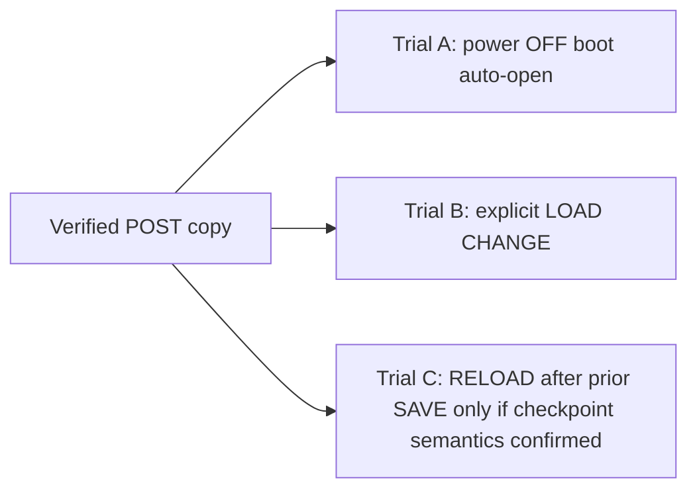

# MO-RC8 Hardware Contrast Trial Plan

- Status: **NOT_RUN** (procedure only; no media writes in this task)
- Work ID: `MO-RC8-STATIC-LINK-INVESTIGATION-PR-1`
- Related investigation: [`MO_RC8_STATIC_LINK_INVESTIGATION.md`](MO_RC8_STATIC_LINK_INVESTIGATION.md)
- Gate C: **NOT_PASS** / Human Gate C: **STOP** / M5: **INCOMPLETE**

## Purpose

Design controlled Octatrack MkII trials to distinguish boot auto-open behavior
from explicit Project **LOAD** and from Project **RELOAD**, after a rename Apply
that passed MasterOCTa verification but failed hardware smoke with an old PATH in
the device LOG.

This document does **not** authorize execution in the repository task that
creates it. It does **not** weaken existing Gate C PASS requirements.

## Primary sources (official)

| Topic | Source | Section / page |
|---|---|---|
| Boot mounts previous set and loads previous project | [Octatrack MkII User Manual, OS 1.40A (210414 PDF)](https://elektron.se/wp-content/uploads/2024/09/Octatrack-MKII-User-Manual_ENG_OS1.40A_210414.pdf) | §7 SETS (~p.26) |
| Explicit Project load (CHANGE in PROJECT menu) | Same manual | §6.2.2, §8.2, §8.4.1 |
| Project SAVE creates rollback checkpoint; RELOAD restores saved state | Same manual | §8.4.1 (~p.31) |
| Active changes cached on card; power off/on continues working state | Same manual | §8 PROJECTS (~p.28) |
| `.strd` = saved by SAVE; `.work` = active project | Same manual | §8.5.5 FILE MANAGER (~p.37) |
| SYNC TO CARD syncs cache before card removal; distinct from SAVE checkpoint | Same manual | §8.4.1 |

Repository cross-reference (observed filename mapping, not vendor filename spec):
[`docs/domain/OCTATRACK_STATE_AND_SAMPLE_SEMANTICS.md`](../domain/OCTATRACK_STATE_AND_SAMPLE_SEMANTICS.md).

## Confirmed manual distinctions (do not conflate)

| Term | Manual meaning | Not the same as |
|---|---|---|
| **Boot auto-load** | On boot, previously mounted set and previous project are loaded when possible | Explicit operator LOAD |
| **LOAD (CHANGE)** | Operator selects a different project from the set list | RELOAD |
| **SAVE** | Writes a rollback checkpoint; also syncs project to card | SYNC TO CARD alone |
| **RELOAD** | Restores project to last **saved** state | LOAD from list; does not mean “re-read card after external edit” |
| **SYNC TO CARD** | Syncs cached working state before card removal | SAVE checkpoint semantics |

## Undetermined (remain open in trials)

- Undocumented RAM-resident sample path cache beyond manual “cached on card” wording
- Machine/slot re-resolution order after external card edits while a session persists
- Which MkII action produced each post-return byte diff in the RC8 incident
- Whether power-off fully clears the path used for STATIC slot 1 playback

Do **not** treat forum posts or third-party summaries as primary evidence.

## Preconditions (every trial)

- Original CF/SD media stay disconnected.
- Do **not** modify the failed card or operator-local preserved evidence from RC8.
- Start from a **disposable copy** whose per-file manifest matches the verified
  **POST-Apply** manifest entry-for-entry (path, type, size, SHA256).
- If no such copy exists, evaluate whether a reconstruction from preserved files
  and manifests is possible. Full manifest match against measured POST is **required**
  before any trial. Label reconstructions **reconstruction**, not “original POST copy”.
- Do **not** reuse a card state autosaved during a prior trial as the next trial’s
  initial state.
- Record power state (full off vs hot remove) and operation timestamps.
- Do **not** use manual sample reassignment as Rename success proof.
- Do **not** clear RC8 Human Gate C **STOP** from this document alone.

## Trial matrix

### Trial A — power off, boot auto-open

1. After verified POST copy is prepared, fully power off MkII (record whether card
   was removed while powered).
2. Insert disposable copy; power on without explicit Project LOAD.
3. Observe which Project opens and Static Slot 1 behavior (name, error, playback).
4. Capture device LOG and a fresh byte manifest after return to Mac (read-only).

**Records:** auto-open occurred yes/no; Static Slot 1 error yes/no; old vs new PATH
symptoms in LOG.

### Trial B — explicit LOAD (CHANGE)

1. From Trial A’s **fresh POST copy** (not Trial A’s autosaved return state), repeat
   power-off insert if required by procedure.
2. Use PROJECT menu → CHANGE → select the target project explicitly (manual LOAD).
3. Test Static Slot 1 without manual reassignment.

**Records:** LOAD steps performed; slot display; playback result; LOG lines.

### Trial C — explicit RELOAD (conditional)

Run only when trial design requires testing **saved checkpoint** semantics:

1. Operator must first establish what SAVE checkpoint exists on the disposable copy
   (SAVE is a distinct manual action; external rename Apply does not substitute).
2. Perform Project RELOAD per manual definition (restore saved state, not CHANGE list load).
3. Observe Static Slot 1.

**Records:** whether SAVE preceded RELOAD; whether RELOAD reverted to pre-rename or
post-rename PATH in `.strd` vs `.work` on returned media.

Trial C is **not** a substitute for Trial B. LOAD and RELOAD answer different questions.

## Per-trial recording template (operator-local)

Record outside the repository:

- MkII OS version; host OS; trial ID (A/B/C)
- Disposable copy manifest SHA256 and entry count (pre-trial)
- Power and card insertion sequence with timestamps
- Operator actions (auto-open / LOAD / RELOAD / SAVE / SYNC TO CARD if any)
- Static Slot 1: displayed name, error state, playback result
- LOG excerpts (sanitized; no personal paths in repo)
- Post-trial manifest diff vs pre-trial POST baseline
- `project.work`, `project.strd`, affected `bank*.work` hash changes
- Whether manual reassignment or save prompts were accepted (yes/no; not success criteria)

## Judgment rules

- Trial B success **alone** does **not** resolve Trial A auto-open failure.
- Manual reassignment that makes sound play is **not** Rename gate success.
- Any unexplained media change vs POST baseline is **STOP** for that trial branch.
- Hardware contrast results update investigation records; they do **not** retroactively
  PASS RC8 Human Gate C while FILE NOT FOUND on the primary smoke path remains unresolved.
- Product PATH codec or Bank rewrite changes require a separate fix proposal and candidate.

## Execution blockers (current)

- Controlled disposable POST copy availability and manifest verification
- Operator scheduling for read-only manifest capture after each trial
- Power-state documentation from the original RC8 session (off vs hot remove)
- Device vs host clock alignment for LOG correlation

Until trials run with the above, RAM / last-used auto-open remains **undetermined**,
not confirmed root cause.
