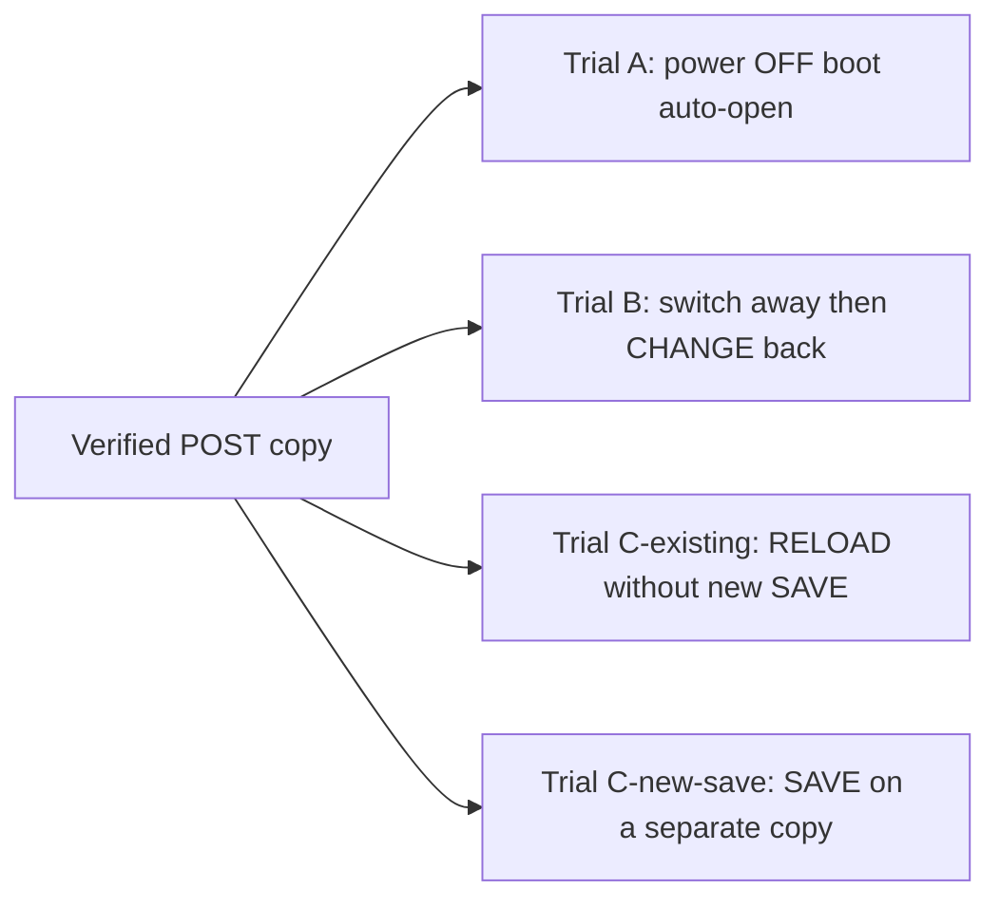

# MO-RC8 Hardware Contrast Trial Plan

- Status: **PARTIAL** — Trial A executed on OCTA2 reconstruction media; Trial B **BLOCKED**; Trial C **NOT_RUN**
- Work ID: `MO-RC8-STATIC-LINK-INVESTIGATION-PR-1`
- Related investigation: [`MO_RC8_STATIC_LINK_INVESTIGATION.md`](MO_RC8_STATIC_LINK_INVESTIGATION.md)
- Gate C: **NOT_PASS** / Human Gate C: **PASS** (formal continuous trial; this contrast document does not by itself authorize that PASS) / M5: **INCOMPLETE**

## Purpose

Design controlled Octatrack MkII trials to distinguish boot auto-open behavior
from explicit Project **LOAD** and from Project **RELOAD**, after a rename Apply
that passed MasterOCTa verification but failed hardware smoke with an old PATH in
the device LOG.

This document does **not** authorize execution in the repository task that
creates it. It does **not** weaken existing Gate C PASS requirements.

## Primary sources (official)

| Topic | Source | Section / page |
|---|---|---|
| Boot mounts previous set and loads previous project | [Octatrack MkII User Manual, OS 1.40A (210414 PDF)](https://elektron.se/wp-content/uploads/2024/09/Octatrack-MKII-User-Manual_ENG_OS1.40A_210414.pdf) | §7 SETS (~p.26) |
| Explicit Project load (CHANGE in PROJECT menu) | Same manual | §6.2.2, §8.2, §8.4.1 |
| Project SAVE creates rollback checkpoint; RELOAD restores saved state | Same manual | §8.4.1 (~p.31) |
| Active changes cached on card; power off/on continues working state | Same manual | §8 PROJECTS (~p.28) |
| `.strd` = saved by SAVE; `.work` = active project | Same manual | §8.5.5 FILE MANAGER (~p.37) |
| SYNC TO CARD syncs cache before card removal; distinct from SAVE checkpoint | Same manual | §8.4.1 |

Repository cross-reference (observed filename mapping, not vendor filename spec):
[`docs/domain/OCTATRACK_STATE_AND_SAMPLE_SEMANTICS.md`](../domain/OCTATRACK_STATE_AND_SAMPLE_SEMANTICS.md).

## Confirmed manual distinctions (do not conflate)

| Term | Manual meaning | Not the same as |
|---|---|---|
| **Boot auto-load** | On boot, previously mounted set and previous project are loaded when possible | Explicit operator LOAD |
| **LOAD (CHANGE)** | Operator selects a different project from the set list | RELOAD |
| **SAVE** | Writes a rollback checkpoint; also syncs project to card | SYNC TO CARD alone |
| **RELOAD** | Restores project to last **saved** state | LOAD from list; does not mean “re-read card after external edit” |
| **SYNC TO CARD** | Syncs cached working state before card removal | SAVE checkpoint semantics |

## Undetermined (remain open in trials)

- Undocumented RAM-resident sample path cache beyond manual “cached on card” wording
- Machine/slot re-resolution order after external card edits while a session persists
- Which MkII action produced each post-return byte diff in the RC8 incident
- Whether power-off fully clears the path used for STATIC slot 1 playback

Do **not** treat forum posts or third-party summaries as primary evidence.

## Preconditions (every trial)

- Original CF/SD media stay disconnected.
- Do **not** modify the failed card or operator-local preserved evidence from RC8.
- Start from a **disposable copy** whose per-file manifest matches the verified
  **POST-Apply** manifest entry-for-entry (path, type, size, SHA256).
- If no such copy exists, evaluate whether a reconstruction from preserved files
  and manifests is possible. Full manifest match against measured POST is **required**
  before any trial. Label reconstructions **reconstruction**, not “original POST copy”.
- Do **not** reuse a card state autosaved during a prior trial as the next trial’s
  initial state.
- Record power state (full off vs hot remove) and operation timestamps.
- Do **not** use manual sample reassignment as Rename success proof.
- Do **not** clear RC8 Human Gate C **STOP** from this document alone.

## Trial matrix

### Trial A — power off, boot auto-open

1. After verified POST copy is prepared, fully power off MkII (record whether card
   was removed while powered).
2. Insert disposable copy; power on without explicit Project LOAD.
3. Observe which Project opens and Static Slot 1 behavior (name, error, playback).
4. Capture device LOG and a fresh byte manifest after return to Mac (read-only).

**Records:** auto-open occurred yes/no; Static Slot 1 error yes/no; old vs new PATH
symptoms in LOG.

### Trial B — explicit LOAD (CHANGE), including a project switch

Selecting CHANGE while the rename-target Project is **already auto-opened is not
a defined LOAD**. The menu may be a no-op, may re-select the same entry, or may
not re-read card documents. Trial B therefore **must** cause a real CHANGE by
leaving the target and returning to it.

**Requires:** the disposable POST copy contains at least one **other** Project in
the same set that is not the rename target. If no such Project exists, Trial B is
**BLOCKED** (do not invent a LOAD by staying on the auto-opened Project).

1. Start from a **fresh POST copy** (not Trial A’s autosaved return state). Repeat
   power-off insert if required by procedure. Boot may auto-open the last-used
   (rename-target) Project; record that, but do not treat it as the LOAD under test.
2. PROJECT menu → CHANGE → select a **different** Project in the same set.
3. Record any SAVE / unsaved-changes prompt when leaving the auto-opened target:
   - For Trial B, **decline** writing a new SAVE checkpoint of the auto-opened
     session. The question is whether an explicit LOAD of the **existing POST
     documents** resolves the slot, not whether a new device SAVE rewrites them.
   - If the device **refuses to leave** the Project without SAVE, stop that copy.
     Record **BLOCKED: SAVE required to switch**. Do **not** SAVE to force the
     switch; that would overwrite the POST comparison target. Use a new POST copy
     and do not continue Trial B on the contaminated card.
4. After the other Project is loaded, PROJECT menu → CHANGE → select the
   **rename-target** Project. This CHANGE-back is the LOAD under test.
5. Test Static Slot 1 without manual reassignment. Do not SAVE between CHANGE-back
   and the slot observation unless a prompt must be recorded as a blocker.

**Records:** other-Project identity (sanitized); SAVE prompt yes/no and whether
it was declined; CHANGE-back steps; slot display; playback result; LOG lines.

Do **not** treat “CHANGE while already on the target” as Trial B success.

### Trial C — RELOAD: existing checkpoint vs new SAVE (separate copies)

LOAD (Trial B) and RELOAD answer different questions. Trial C is **not** a
substitute for Trial B.

MkII **SAVE** writes a rollback checkpoint (`.strd` per the manual). MasterOCTa
Apply also rewrote `project.strd` on the POST copy; that is **not** a device SAVE.
Do **not** perform a trial-eve device SAVE on the copy whose existing checkpoint
you intend to compare against POST.

#### C-existing — RELOAD the checkpoint already on the POST copy

Use a **fresh POST copy**. Do **not** SAVE on this copy before RELOAD.

1. Identify the existing checkpoint without rewriting it: POST `project.strd`
   hash must still match the verified POST manifest. Record that this checkpoint
   was produced by Apply (and any earlier device SAVE history unknown to this
   trial), not by a SAVE performed in this trial.
2. Boot / insert per procedure. If a SAVE prompt appears before RELOAD, decline
   it. If SAVE is required to proceed, **BLOCKED** on this copy (same rule as
   Trial B step 3).
3. Perform Project RELOAD per the manual (restore **saved** state, not CHANGE
   list load).
4. Observe Static Slot 1. Capture a read-only return manifest.

**Records:** pre-RELOAD `project.strd` hash still equals POST; RELOAD performed
yes/no; slot / LOG; whether `.work` / `.strd` hashes changed after return.

**Does not answer:** what happens after the operator creates a **new** SAVE.

#### C-new-save — new device SAVE, then RELOAD (different copy)

Use a **second fresh POST copy**. Never reuse the C-existing card after any SAVE.

1. Boot / insert. Optionally complete Trial B’s CHANGE-back first if the
   operator needs the target Project explicitly loaded; record that sequence.
2. Perform MkII **SAVE**. This **replaces** the SAVE checkpoint. From this moment
   the copy is **not** comparable to original POST `.strd`. Record post-SAVE
   `project.strd` / `.work` hashes as the **new** comparison baseline for this
   branch only.
3. Perform RELOAD. Observe Static Slot 1. Capture return manifest vs the
   **post-SAVE** baseline, not vs original POST.

**Records:** that a new SAVE occurred; new baseline hashes; RELOAD result; LOG.

Do **not** SAVE on a copy and then claim the result still represents the original
POST checkpoint.

## Per-trial recording template (operator-local)

Record outside the repository:

- MkII OS version; host OS; trial ID (`A` / `B` / `C-existing` / `C-new-save`)
- Disposable copy manifest SHA256 and entry count (pre-trial)
- Power and card insertion sequence with timestamps
- Operator actions (auto-open / LOAD / RELOAD / SAVE / SYNC TO CARD if any)
- Static Slot 1: displayed name, error state, playback result
- LOG excerpts (sanitized; no personal paths in repo)
- Post-trial manifest diff vs pre-trial POST baseline
- `project.work`, `project.strd`, affected `bank*.work` hash changes
- Whether manual reassignment or save prompts were accepted (yes/no; not success criteria)

## Judgment rules

- Trial B success **alone** does **not** resolve Trial A auto-open failure.
- Trial B requires a CHANGE **away** then CHANGE **back**. Staying on an
  auto-opened target is not a LOAD.
- C-existing success does **not** answer C-new-save, and vice versa.
- A device SAVE performed for C-new-save **invalidates** original POST `.strd`
  as the comparison target for that copy.
- Manual reassignment that makes sound play is **not** Rename gate success.
- Any unexplained media change vs POST baseline is **STOP** for that trial branch.
- Hardware contrast results update investigation records; they do **not** retroactively
  PASS RC8 Human Gate C while FILE NOT FOUND on the primary smoke path remains unresolved.
- Product PATH codec or Bank rewrite changes require a separate fix proposal and candidate.

## Trial A execution record (OCTA2 reconstruction)

Work IDs: `MO-RC8-OCTA2-TRIAL-A-STAGING-1`, `MO-RC8-OCTA2-STAGING-RESUME-1`,
`MO-RC8-OCTA2-TRIAL-A-POST-CAPTURE-1`, `MO-RC8-TRIAL-A-EVIDENCE-RECONCILE-1`.

Trial A was executed on **secondary media** using a **reconstruction** disposable
copy built from operator-local preserved evidence. This is **not** the primary RC8
Apply card and **not** a continuous PRE→Apply→hardware run on one clone.

| Field | Record |
|---|---|
| Initial card state | Reconstruction POST-equivalent manifest; **84 / diffs=0 PASS** vs CARD_POST reference |
| Power / insert | **Unconfirmed.** Do not treat this session as a verified power-on or power-off trial |
| Confirmed operator sequence | Compact-card warning → YES → target Project loaded → Static Slot 1 new-name playback without ERROR |
| Explicit Project LOAD | **No** — warning YES is not CHANGE-away / CHANGE-back |
| Launched MasterOCTa / Apply | **Did not occur.** Launched-binary identity **N/A** |
| Pre-trial vs post-trial manifest | **PASS**, diffs=0 |
| Card root LOG at post-trial capture | **None** |
| Primary RC8 Human Gate C **STOP** | **Unchanged** |

Trial A on OCTA2 reconstruction media does **not** satisfy Gate C step 15 on the
primary RC8 Apply path. It does **not** prove unconditional boot auto-open. It does
**not** substitute for
[`MO_RC8_GATE_C_FORMAL_CONTINUOUS_TRIAL.md`](MO_RC8_GATE_C_FORMAL_CONTINUOUS_TRIAL.md).
Formal-trial explicit LOAD is defined there: add a second Project **before PRE
freeze** on a **new** clone; re-baseline clone verification to a new two-Project
trial source; do not retry PRE→Apply on this one-Project copy.

Preservation count correction (105 vs manifest 60): see
[`MO_RC8_STATIC_LINK_INVESTIGATION.md`](MO_RC8_STATIC_LINK_INVESTIGATION.md)
§ OCTA2 reconstruction trial.

## Execution blockers (current)

| Trial | Status | Blocker |
|---|---|---|
| Trial A (primary RC8 POST copy) | **NOT_RUN** | No verified continuous clone from primary Apply remains available for this matrix entry |
| Trial A (OCTA2 reconstruction) | **EXECUTED** | See execution record above; does not clear primary RC8 STOP |
| Trial B | **BLOCKED** | Disposable POST copy has no second Project in the same set for CHANGE-away / CHANGE-back |
| Trial C-existing | **NOT_RUN** | Depends on fresh POST copy and operator scheduling |
| Trial C-new-save | **NOT_RUN** | Requires separate fresh POST copy |

Additional blockers:

- Power-state documentation from the original RC8 session (off vs hot remove)
- Device vs host clock alignment for LOG correlation
- OCTA2 Trial A launched-binary identity is **N/A** (no MasterOCTa Apply).
  Formal continuous trial must re-verify frozen RC8 binary identity independently

Until primary-path trials run with the above, RAM / last-used auto-open remains
**undetermined**, not confirmed root cause.
